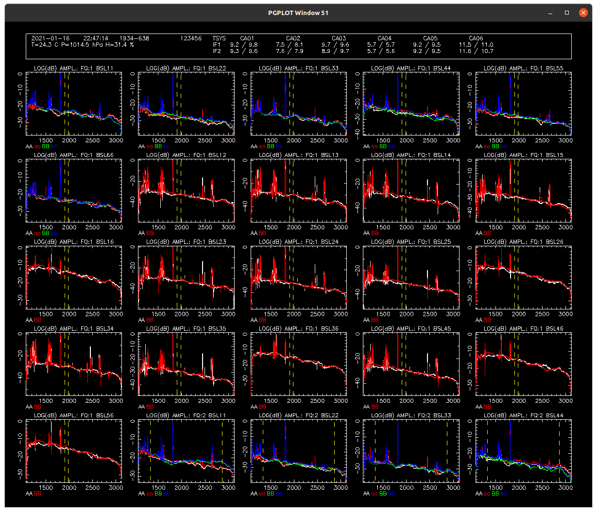

# NSPD
A "clone" of ATCA's SPD, with extra features.



## Introduction

The `nspd` application, like the `spd` application it clones and is used
online at the ATCA, allows you to view the raw data coming from the
telescope. It does this by displaying spectra for different antennas and
baselines for each integration.

## Usage

This is a command-line tool with a PGPLOT display.

### Command-line options

```
 $ ./nspd --help
Usage: nspd [OPTION...] [options]
new/network SPD

  -d, --device=PGPLOT_DEVICE The PGPLOT device to use
  -D, --default-dump=DUMP_TYPE   The plot type to use as default for output
                             files (default: PNG)
  -f, --file=FILE            Use an output file as the input
  -p, --port=PORTNUM         The port number on the server to connect to
  -s, --server=SERVER        The server name or address to connect to
  -u, --username=USERNAME    The username to communicate to the server
  -v, --verbose              Output debugging information
  -?, --help                 Give this help list
      --usage                Give a short usage message
  -V, --version              Print program version

Mandatory or optional arguments to long options are also mandatory or optional
for any corresponding short options.

Report bugs to <Jamie.Stevens@csiro.au>.
```

In normal operation, `nspd` is connected to an `rpfitsfile_server` which is
providing the data from an RPFITS file. If you're running the server on your
own machine, `nspd` is usually started in the following way.

```bash
./nspd -d /xs -s localhost
```

If the server is not running on your local machine, you can specify the
server address and TCP port number with the `-s` and `-p` options respectively.

If you're trying to use both `nvis` and `nspd` at the same time and have changes
in one be reflected in the other, you can also specify a username with the
`-u` option; any clients with that same username will update automatically
whenever changes are made in any other client. The username can be anything,
but only the first 20 characters are used.

Upon start, you will see something like the following appear in your terminal
(assuming you've connected to an `rpfitsfile_server`):

```
 $ ./nspd -d /xs -s localhost -u abc123
client ID = ,.^SdV4SIaOh-_'40wE
Connected to SIMULATOR server.
NSPD> 
```

The `Client ID` is a unique 20-character-long string identifying this client,
as is randomly generated at each execution; this is useful primarily for
working out which clients have requested what in the logs from
`rpfitsfile_server`.

The `NSPD>` prompt will appear whenever `nspd` is ready to accept commands.

### Display

`nspd` shares many of the display qualities as `spd`, so as to ensure that
if you're familiar with examining `nspd` you'll be at ease with `spd`
when you're actually in control of the telescope.

There are some differences however, in order to make it clearer what is
being displayed. For example, there is an area at the top of the display
which shows the time label for the data being shown, some environmental
data, and the system temperatures.

---

### Interactive commands

Like `spd`, what `nspd` displays is controlled by commands given at the
`NSPD>` prompt. This section describes the commands that `nspd` understands.

Each command can be given with minimum match; the minimum string is given
for each command below in **bold**. For example, you may give the **sel**ect
command as `sel` or `select`, or even `sele`, but not `se`.

---

#### amplitude

Format: **a**mplitude [*min amplitude* *max amplitude*]

This command makes `nspd` display amplitude as the y-axis of each of the
panels. If you would like to limit the range of each panel, you can specify
both the *min amplitude* and *max amplitude* arguments. This will limit all
the panels of all the IFs in the same way.

If you want to reset the amplitude scaling to the default (which will be to
contain all the data on each panel, which likely means that each panel has
its own range), give this command without arguments.

The range should be given on the linear axis values, even if plotting the amplitude
on a logarithmic scale.

---

#### array

Format: **arr**ay *antennas*

This command selects which antennas are available to display. You can
specify which antennas to include either as a list or a string.
For example: `arr 1 2 3 4 5` would make `nspd` show any antenna product
or baseline which only included antennas 1 through 5 inclusive. This is
equivalent to the more traditional `spd` format of `array 12345`.

---

#### backward

Format: **back**ward

This command instructs the server to supply the data from the cycle
immediately prior to the currently displayed data.

While the server retrieves the data from file, `nspd` will continue to
show the current data.

---

#### channel

Format: **ch**annel [[*IF name*] *min channel* *max channel*]

Change the channel range shown on each panel. If no arguments are given
along with this command, then all the channels for all IFs are shown.

If given with two arguments, then all panels for all IFs are shown with
the same range, which is specified by the *minimum* and *maximum* channel
arguments. Both these arguments are inclusive, such that if the command
`chan 1 100` is given, all channels from 1 to 100 (and including channels
1 and 100) are shown on the panels.

If given with three arguments, the first argument specifies the IF to
restrict. The IF can be specified in several ways:
- f*n*: where f1 is the first continuum band, and f3 is usually the
  first zoom band, and *n* can continue up until however many zooms
  are in the data + 2
- z*n*: where z1 is the first zoom band, and *n* can continue up until
  however many zooms are in the data
- z*m*-*n*: where z1-2 is the second zoom band associated with the first
  continuum band, and z2-5 is the fifth zoom band associated with the second
  continuum band; here *m* can be either 1 or 2, and *n* is between 1 and 16
  inclusive, depending on how many zooms are configured

Note that you cannot unrestrict a single IF with this command, ie.
`chan f1` will not do anything. If you need to reset the channel range
to default for one IF, you must do it for all IFs.

---

#### delavg

Format: **delav**g [*band*] *number of channels*

This command instructs the server to recompute data while performing
averaging over phase while calculating the delay errors.

If only one argument is supplied, the *number of channels* specified
will be used as the averaging level for all the IFs available in the
data. If two arguments are supplied, the first argument specifies
the IF to change the averaging level for. The IF can be specified as for
the **chan**nel command.

While the server recomputes the data, `nspd` will continue to show the
current data.

Note that the phase, amplitude, real and imaginary spectra shown by
`nspd` will not be affected by changing this setting. The only thing
that will differ will be the averaged phase quantity available through
the **sho**w **av**eraged command. Changing this parameter will affect
any `nvis` clients connected with the same username however.

---

#### delay

Format: **delay** [*min delay* *max delay*]

This command makes `nspd` display the delay errors computed from all the
adjacent channels within the tvchannel range currently set. All calculations
are done by `nspd` and thus communication with the server is not
required. If you would like to limit the range of each panel, you can specify
both the *min delay* and *max delay* arguments. This will limit all
the panels of all the IFs in the same way.

If you want to reset the delay scaling to the default (which will be to
contain all the data on each panel, which likely means that each panel has
its own range), give this command without arguments.

Each panel will show a sorted list of all the computed delay errors, with
the lowest delays displayed on the left, and the highest on the right.
The x-axis is simply ordinal, and represents the number of adjacent pairs
of channels in the **tvch**annel range. The y-axis is delay error, in ns.

Two horizontal lines are also plotted, one solid and one dashed. The solid
line represents the mean value of all the delays, and the dashed line
represents the median value. Often, these will be plotted so near to each
other that only the solid line remains visible.

If the averaged data is being displayed (via **sho**w **av**eraged command),
then the delay errors computed between the averaged data will also be
displayed in each panel. Of course, since the number of channels decreases
with increasing **delav**g values, the averaged data will appear to the left
of each panel, although the horizontal lines will continue to span the
entire width of the plot.

---

#### dump

Format: **dump** [*filename*]

Output the current plot to a file. If no argument is specified, then the
filename is generated automatically to be
`nspd_plot_yyyy-mm-dd_HHMMSS`, where `yyyy` is the year (like 2021),
`mm` is the month (like 06), `dd` is the date (like 02), `HH` is the
hour (like 23), `MM` is the minute and `SS` is the second. The time is
in the local timezone according to the machine that `nspd` is running on.

`nspd` can output two types of files: PNG and PS. If the filename is
generated automatically, the type of file created will depend on the
value of the argument supplied to the `-D` option when `nspd` was started.
If no `-D` option was specified, the default PNG will be output. To output
PS without specifying an argument, run `nspd -D ps`.

If a *filename* argument is supplied to the **dump** command, the type of
output will be determined by the extension of that *filename*. If no extension
is supplied (or an extension which isn't `.png` or `.ps`) then the default
file type will be used, exactly as above. If an extension is supplied, the
appropriate file type will be used.

When this command is executed, some output will be given in the terminal
telling you what file is created. For example:

```
NSPD> dump newtest
 NSPD output to file newtest.png
 ```

---

#### exit

Format: **exit**

Exit `nspd`.

---

#### forward

Format: **forw**ard

This command instructs the server to supply the data from the cycle
immediately subsequent to the currently displayed data.

While the server retrieves the data from file, `nspd` will continue to
show the current data.

---

#### get

Format: **get** *quantity* *arguments*

Get some *quantity* from the server. The options for *quantity* are:

##### time

Format: **get** **tim**e [*yyyy-mm-dd*] *HH:MM*[*:SS*]

Get a new cycle of data from the server, specified by a time and optional
date. The date will need to be specified only if the data coming from the
server spans more than one day.

While specifying the time, only the hours and minutes are necessary; if the
seconds are omitted, "00" seconds is assumed.

The server will return data for the cycle whose mid-cycle time is nearest
to the specified time. While the server retrieves the data, `nspd` will
continue to show the current data.

---

#### hide

Format: **hid**e *parameter*

Stop showing some *parameter* on the displayed panels. The options for
*parameter* are:

##### tvchannels

Format: **hid**e **tvch**annels

Stop showing the tvchannel range indicators on the displayed panels. These
indicators are vertical yellow dashed lines at the minimum and maximum
tvchannels.

##### averaged

Format: **hid**e **av**eraged

Stop showing the data which has been binned by the **delavg** value.

---

#### imaginary

Format: **i**maginary [*min imaginary* *max imaginary*]

This command makes `nspd` display the imaginary part of the complex
visibility as the y-axis of each of the panels. If you would like to limit
the range of each panel, you can specify both the *min imaginary* and
*max imaginary* arguments. This will limit all the panels of all the
IFs in the same way.

If you want to reset the imaginary scaling to the default (which will be to
contain all the data on each panel, which likely means that each panel has
its own range), give this command without arguments.

---

#### list

Format: **lis**t

Produce a list of the cycles that are available from the server. Something
like the following will be output in the controlling terminal after this
command is given:

```
NSPD> list
 CYCLE 1: 2021-01-16 22:47:04
 CYCLE 2: 2021-01-16 22:47:14
 ....
 CYCLE 107: 2021-01-16 23:04:44
 CYCLE 108: 2021-01-16 23:04:54
```

For each cycle, the date and time at the midpoint of the cycle is shown.
Whenever the time between cycles differs by more than the cycle time, the
two cycles before the gap and the two cycles after are shown; this usually
happens at scan boundaries. Whenever there is a set of cycles which are each
simply separated by the cycle time, the ouput will be truncated by `....`.

---

#### nxy

Format: **nxy** *nx* *ny*

Set the number of panels to display in the horizontal direction (*nx*) and
vertical direction (*ny*).

By default, `nspd` starts with *nx* and *ny* both set to 5. Each of *nx*
and *ny* can be set to any number between 1 and 7 inclusive. For ATCA,
with its 15 baselines and 6 antennas, an *nx* of 3 and *ny* of 7 can
display all these 21 products on the same page quite comfortably.

---

#### off

Format: **off** *product* [*product* ...]

Disable the plotting of one or more *product*. These products are:

##### acs

Format: **off** acs

Disables plotting of autocorrelations, or more precisely, products related
to a single antenna only.

##### ccs

Format: **off** ccs

Disables plotting of cross-correlations involving more than one antenna.

##### aa/bb/ab/ba

Format: **off** aa/bb/ab/ba

Disables plotting of certain polarisation correlations.

---

#### on

Format: **on** *product* [*product* ...]

Enable the plotting of one or more *product*. These products are:

##### acs

Format: **on** acs

Enables plotting of autocorrelations, or more precisely, products related
to a single antenna only.

##### ccs

Format: **on** ccs

Enables plotting of cross-correlations involving more than one antenna.

##### aa/bb/ab/ba

Format: **on** aa/bb/ab/ba

Enables plotting of certain polarisation correlations.

---

#### phase

Format: **p**hase [*min phase* *max phase*]

This command makes `nspd` display the phase as the y-axis of each of
the panels. If you would like to limit the range of each panel, you can
specify both the *min phase* and *max phase* arguments. This will limit
all the panels of all the IFs in the same way.

If you want to reset the phase scaling to the default (which will be
to contain all the data on each panel, which likely means that each panel
has its own range), given this command without arguments.

---

#### quit

Format: **quit**

Exit `nspd`.

---

#### real

Format: **r**eal [*min real* *max real*]

This command makes `nspd` display the real part of the complex visibility
as the y-axis of each of the panels. If you would like to limit the
range of each panel, you can specify both the *min real* and *max real*
arguments. This will limit all the panels of all the IFs in the same way.

If you want to reset the real scaling to the default (which will be to contain
all the data on each panel, which likely means that each panel has its own
range), give this command without arguments.

---

#### scale

Format: **sca**le _**log**arithmic/**lin**ear_

Change how the amplitude quantity is displayed. If set to **lin**ear, then
the data will be shown as is. If set to **log**arithmic, the maximum value
either of the data on each panel, or the value set as the *max amplitude*,
will be set as 0 dB, and displayed at the top of each panel. The amplitudes
will be scaled as 10 log(v/m), where the log is base 10, v is the linear value
and m is the value assigned as 0 dB. The minimum value displayed will always
be -120 dB or greater.


---

#### select

Format: **sel**ect *product* [*product* ...]

This command selects which products to show in each panel. You may specify
any number of products in a single command. These products are the polarisations
codes **aa**, **bb**, **ab**, **ba**, or one of the band names, like **f1**,
**f2**, **z1** etc.

Only products that have been enabled with the **on** command will be displayed.
For example, normally **ab** and **ba** are not enabled for cross-correlations
and thus will not be displayed even if selected with this command.

---

#### show

Format: **sho**w *parameter*

Show some *parameter* on the displayed panels. The options for
*parameter* are:

##### tvchannels

Format: **sho**w **tvch**annels

Show the tvchannel range indicators on the displayed panels. These indicators
are vertical yellow dashed lines at the minimum and maximum tvchannels.

##### averaged

Format: **sho**w **av**eraged

Show the data which has binned by the **delavg** value.

While the server only uses the **delavg** value to smooth phase before
computing the delay error, `nspd` will compute and display all the
parameters (amplitude, phase, real and imaginary) smoothed by **delavg**.
When shown, a new line will be displayed on each panel for each polarisation
product, and this line will be labelled with a "v" on the end of the
corresponding product. For example, if "AA" is displayed on a panel,
the smoothed line will be labelled as "AAv", and shown in a different colour.

When **delavg** is 1, the two lines will be plot exactly over each other,
and since the "v" line is drawn later than the normal product, the line visible
on the panel will be in the "v" colour.

---

#### tvchannel

Format: **tvch**annel [*IF* *min chan* *max chan*]

This command instructs the server to recompute data with a different range
of tvchannels.

To set the channels, an *IF* argument needs to be supplied, followed
by the *min chan* and *max chan* to use for that IF. The *IF* can be
something like `f1` or `f2` or `z1`, and is basically whatever you would
use to select that IF in `nspd`.

While the server recomputes the data, `nspd` will continue to show the
current data.

---

#### tvmedian

Format: **tvmed**ian [*IF*] *on/off*

This command instructs the server to recompute data with median averaging
either enabled or disabled.

If a single argument is given to this command, the setting will affect
all IFs in the data currently being displayed; the setting can be *on*
(indicating that median averaging should be used), or *off* (indicating
that mean averaging should be used). If two arguments are given, the
first argument must be the name of the *IF*, something like `f1`, or `f2`,
or `z1`, and is basically whatever you would use to select that IF in
`nspd`.

While the server recomputes the data, `nspd` will continue to show the
current data.

---

#### x

Format: **x**

Change the x-axis. This command acts as a toggle to switch between plotting
frequency on the x-axis, and channel number. By default, when `nspd` is
first started, the x-axis is set to show frequency in MHz.

The x-axis is always shown with low values on the left and high values on
the right.
