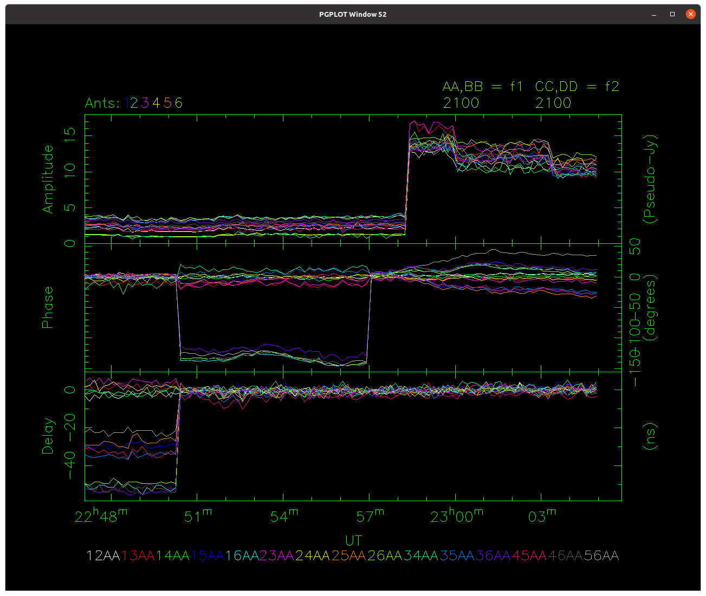
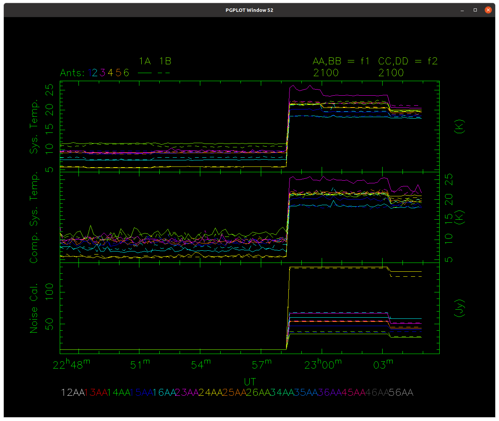

# nvis
A "clone" of ATCA's vis, with extra features.



## Introduction

The `nvis` application, like the `vis` application it clones and is used
online at the ATCA, allows you to quickly ascertain the quality and properties
of the data. It does this by displaying averaged quantities for different
antennas and baselines, and how they vary over time.

## Usage

This is a command-line tool with a PGPLOT display.

### Command-line options

```
 $ ./nvis --help
Usage: nvis [OPTION...] [options]
new/network VIS

  -d, --device=PGPLOT_DEVICE The PGPLOT device to use
  -D, --default-dump=DUMP_TYPE   The plot type to use as default for output
                             files (default: PNG)
  -f, --file=FILE            Use an output file as the input
  -p, --port=PORTNUM         The port number on the server to connect to
  -s, --server=SERVER        The server name or address to connect to
  -u, --username=USERNAME    The username to communicate to the server
  -?, --help                 Give this help list
      --usage                Give a short usage message
  -V, --version              Print program version

Mandatory or optional arguments to long options are also mandatory or optional
for any corresponding short options.

Report bugs to <Jamie.Stevens@csiro.au>.
```

In normal operation, `nvis` is connected to an `rpfitsfile_server` which is
providing the data from an RPFITS file. If you're running the server on your
own machine, `nvis` is usually started in the following way.

```bash
./nvis -d /xs -s localhost
```

If the server is not running on your local machine, you can specify the
server address and TCP port number with the `-s` and `-p` options respectively.

If you're trying to use both `nvis` and `nspd` at the same time and have changes
in one be reflected in the other, you can also specify a username with the
`-u` option; any clients with that same username will update automatically
whenever changes are made in any other client. The username can be anything,
but only the first 20 characters are used.

Upon start, you will see something like the following appear in your terminal
(assuming you've connected to an `rpfitsfile_server`):

```
 $ ./nvis -d /xs -s localhost -u abc123
Client ID = sY+x)7CravyYglNFO)e
Connected to SIMULATOR server.
NVIS> 
```

The `Client ID` is a unique 20-character-long string identifying this client,
and is randomly generated at each execution; this is useful primarily for
working out which clients have requested what in the logs from
`rpfitsfile_server`.

The `NVIS>` prompt will appear whenever `nvis` is ready to accept commands.

### Display

`nvis` shares many of the same display qualities as `vis`, so as to ensure
that if you're familiar with examining `nvis` you'll be at ease
with `vis` when you're actually in control of the telescope.

Some things are different however, in order to make it clearer what is
being displayed. For example, instead of having the source name and central
frequencies of the two "calibration" IFs being jammed up at the top-right
of the display like `vis`, `nvis` shows the IFs being displayed, and their
frequencies underneath that. You may also display more than three panels if
you'd like, which is something that `vis` cannot do. At the moment, `nvis`
does not however have the symbol legend that `vis` does at the top of the display,
but this may come in future updates.

You cannot currently use any x-axis other than time with `nvis` either, but
this will also be rectified as development continues; it is intended that
`nvis` will be used in the BIGCAT era.

To change which panels `nvis` displays, you can give a panel specifier in much
the same way as `vis`. For example, the following two commands are identical,
and will cause both `vis` and `nvis` to show the "Amplitude", "Phase" and
"Delay" plots (in that order, from top to bottom), with "UT" along the x-axis.

```
apd-t
```

```
tapd
```

In the first example, the x-axis is given as the last character, after the
`-`, while in the first example the x-axis is given as the first character.
Each other character instructs `nvis` about which panels to display, in order
from top to bottom; in this case "a" (Amplitude), "p" (Phase) and "d" (Delay).

The complete list of all panels available to display in `nvis` is given in the
table below, along with a brief description if necessary. This list is given in
alphabetical order, and each character specification is case-sensitive.

Character | Panel Displayed
--------- | ---------------
a         | Amplitude: the average amplitude on each baseline per cycle
c         | Closure phase: the closure phase quantity calculated for some baselines with the reference antenna per cycle
C         | Computed System Temperature: the system temperature of each antenna, as computed using the options currently supplied by this client
d         | Delay: the delay error as determined by examining the phases as a function of frequency
D         | Wind Direction: the direction the wind is coming from
G         | GTP: the gated total power measured online
H         | Humidity: as reported by the site weather station
n         | The amplitude of the noise diode in Jy: this is measured per antenna
N         | SDO: the synchronously-demodulated output measured online
p         | Phase: the average phase on each baseline per cycle
P         | Pressure: as reported by the site weather station
R         | Rain Gauge: as reported by the site weather station
S         | System Temperature: the system temperature of each antenna, as computed online by the correlator using the options that were set during the observation
t         | Time: the UTC, can be used as an x-axis
T         | Temperature: as reported by the site weather station
V         | Wind Speed: as reported by the site weather station
X         | Seeing Monitor Phase: the phase measured on the seeing monitor interferometer
Y         | Seeing Monitor RMS Phase: the phase RMS noise measured on the seeing monitor interferometer

For each panel, a label indicating what it is can be found on the left of the
display, and the units being plotted on the right. The axis scaling is usually
alternated between the left and right to ensure that the numbers don't collide
between adjacent panels.

At the bottom of the display is the colour key between baselines, polarisations
and colours. Up to 16 different lines can be plotted, and for all panels which
display baselines (even auto-correlated baselines), the colour key will apply.

For the closure phase, only baselines that do not include the reference antenna
are plotted in the panel, and they have the same colour coding as the other
panels. The associated closure phase triangle consists of the two antennas in that
baseline, plus the reference antenna.

For measurements that do not depend on baselines (like the weather station
parameters), only a single line will be shown, and it will usually be white-ish.

For parameters that depend on antenna only (like system temperatures), the line
colours are specified by the antenna colours shown next to the "Ants:" label at
the top of the display. In addition, as shown in the image below, a key between
line style and polarisation will be displayed to the right of the antenna colour
key.



---

### Interactive commands

Like `vis`, what `nvis` displays is controlled by commands given at the
`NVIS>` prompt. This section describes the commands that `nvis` understands.

Each command can be given with minimum match; the minimum string is given
for each command below in **bold**. For example, you may give the **sel**ect command
as `sel` or `select`, or even `sele`, but not `se`.

---

#### array

Format: **arr**ay *antennas*

This command selects which antennas are available to show in each panel.
This interacts with the select command to decide which products to show.

You can specify which antennas to include either as a list or a string.
For example:
`arr 1 2 3 4 5` would allow any products that only include antennas 1 through 5
inclusive. This is equivalent to the more traditional `vis` format of
`array 12345`.

---

#### calband

Format: **calb**and [*IF1* [*IF2*]]

This command selects which IFs are plotted as AA/BB/AB (*IF1*) and
CC/DD/CD (*IF2*).

If used without an argument, the current calbands are printed to the
terminal. The same information can be gleaned from the top right of
the plot.

If a single argument is supplied, that band will become the only one
plotted (so only AA/BB/AB products will be available). If two arguments
are supplied, those two bands will become available.

Each argument can be specified in several ways:
- f: if this is specified as argument 1, then the first continuum band is
  selected, and if specified as argument 2, the second continuum band is
  selected
- f*n*: where f1 is the first continuum band, and f3 is usually the
  first zoom band, and *n* can continue up until however many zooms
  are in the data + 2
- z: if this is specified as argument 1, then the first zoom band associated
  with the first continuum band is selected, and if specified as argument 2,
  the first zoom band associated with the second continuum band is selected
- z*n*: where z1 is the first zoom band, and *n* can continue up until
  however many zooms are in the data
- z*m*-*n*: where z1-2 is the second zoom band associated with the first
  continuum band, and z2-5 is the fifth zoom band associated with the second
  continuum band; here *m* can be either 1 or 2, and *n* is between 1 and 16
  inclusive

Because the server computes all the vis data for all the bands at the same
time, any change to the calband setting is instantly enacted in the plots.

If you want to change a parameter like **tvmedian** for a specific band,
it must first be selected as one of the calbands, since **tvmedian** only
accepts positional arguments. This is unlike **tvchannel** which accepts
an *IF* argument, meaning you can change the setting for a band which is
not currently set as a calband.

---

#### data

Format: **dat**a [*time*/*off*]

This command tells `nvis` to output the details of the observation configuration.
If *time* is not specified, `nvis` will output details for the most recently
specified time, and if no time was previously specified, for the most recent
integration. Otherwise it will output the details for the integration closest
to the *time* specified. The *time* can be specified like `13:28:10` or
`19:21`.

The output will look similar to the following:

```
NVIS> data
DATA AT 2021-01-16  23:04:54:
  HAS 2 IFS CYCLE TIME 10
  SOURCE 1934-638        OBSTYPE 
 IF 1: CF 2100.00 MHz NCHAN 2049 BW 2048 MHz (AA BB AB)
 IF 2: CF 2100.00 MHz NCHAN 2049 BW 2048 MHz (CC DD CD)
```

The time at the midpoint of the cycle selected is shown, along with information
including:
* how many IFs were configured
* the cycle time
* the name of the source being observed
* the observation type of the scan
* the configuration of each IF, including:
  * the centre frequency
  * the number of channels
  * the total bandwidth
  * and when the IF is selected as one of the calbands, the polarisation
    letters that can be used in `nvis` are shown in parentheses

If a *time* has been specified, a dashed vertical line will be displayed at
that exact time - not at the midpoint of the nearest cycle.

If you want to stop plotting any time indications, give the *off* argument
to this command.

---

#### dcal

Format: **dcal**

This command computes the delay corrections required from the **nncal**
cycles before (and including) the time specified by the **dat**a command, and then
sends these delay corrections to the server which recomputes the data
incorporating them.

The delay corrections are determined by looking at the delay values that
`nvis` knows about, so they depend on the settings of **tvch**annel,
**delav**g and **tvmed**ian. The exact corrections are always made with
respect to what **ref**ant is set to.

This command will output something like the following to the controlling
terminal:
```
NVIS> dcal
 BAND 1, MJD 59230.931770 - 59230.932002:
   ANT 1: X = 0.000 Y = 0.000 XY = 7.032 ns
   ANT 2: X = 2.570 Y = -8.356 XY = -3.875 ns
   ANT 3: X = -2.018 Y = -15.916 XY = -6.830 ns
   ANT 4: X = -0.718 Y = -11.540 XY = -3.771 ns
   ANT 5: X = 29.788 Y = 26.810 XY = 4.088 ns
   ANT 6: X = 52.191 Y = 95.145 XY = 49.991 ns
 BAND 2, MJD 59230.931770 - 59230.932002:
   ANT 1: X = 0.000 Y = 0.000 XY = 37.744 ns
   ANT 2: X = -43.865 Y = -86.580 XY = -5.309 ns
   ANT 3: X = -12.906 Y = -35.238 XY = 15.392 ns
   ANT 4: X = 53.908 Y = -37.341 XY = -54.514 ns
   ANT 5: X = 18.134 Y = 42.308 XY = 61.888 ns
   ANT 6: X = 60.307 Y = 5.331 XY = -17.265 ns
```

For each of the calbands, the MJD range for the corrections is specified, along
with the delay determined from the data in ns, for each of the X and Y receptors
(where the reference antenna is set to have 0 delay and all other antennas are
with respect to the reference antenna), and the delay between the X and Y receptors
given as `XY` for each antenna.

The delay will only be corrected for the **nncal** cycles selected. While
the server recomputes the data, `nvis` will continue to show the current data.

---

#### delavg

Format: **delav**g *number of channels* [*number of channels*]

This command instructs the server to recompute data while performing
averaging over phase while calculating the delay errors.

If only one argument is supplied, the number of channels specified will
be used as the averaging level for both current calband IFs. If two arguments
are supplied, the first will be used for IF 1, and the second will be used
for IF 2.

While the server recomputes the data, `nvis` will continue to show the
current data.

---

#### dump

Format: **dump** [*filename*]

Output the current plot to a file. If no argument is specified, then the
filename is generated automatically to be
`nvis_plot_yyyy-mm-dd_HHMMSS`, where `yyyy` is the year (like 2021),
`mm` is the month (like 06), `dd` is the date (like 02), `HH` is the
hour (like 23), `MM` is the minute and `SS` is the second. The time is
in the local timezone according to the machine that `nvis` is running on.

`nvis` can output two types of files: PNG and PS. If the filename is
generated automatically, the type of file created will depend on the
value of the argument supplied to the `-D` option when `nvis` was started.
If no `-D` option was specified, by default PNG will be output. To output
PS without specifying an argument, run `nvis -D ps`.

If a *filename* argument is supplied to the **dump** command, the type of
outut will be determined by the extension of that *filename*. If no extension
is supplied (or an extension which isn't `.png` or `.ps`) then the default
file type will be used, exactly as above. If an extension is supplied, the
appropriate file type will be used.

When this command is executed, some output will be given in the terminal
telling you what file was created. For example:

```
NVIS> dump newtest
 NVIS output to file newtest.png
```

---

#### exit

Format: **exit**

Exit `nvis`.

---

#### history

Format: **hist**ory *time range* [*start time offset*]

This command tells `nvis` how much historical data to display. If only one
argument is given to this command, then both *time range* and
*start time offset* become this argument. For example, `hist 10m` is equivalent
to saying "display 10m of data starting 10m ago".

Another example: `hist 20m 1h` displays 20m of data, starting from 1h ago. That
is, if 0 is the present moment, `nvis` would display data from between -60m and
-40m.

Examples of valid time strings accepted by this command: `30s`, `20m`, `2h`,
`2h20m`, `1d14h`.

---

#### nncal

Format: **nnc**al [*number of cycles*]

This command sets the number of cycles to look at when computing calibration
correction values; it does not do anything by itself when the command is given.

If this command is given without arguments, the current setting is displayed
in the controlling terminal. If a single argument is supplied, and can be
intepreted as a non-zero positive integer number, the setting is updated.

---

#### onsource

Format: **ons**ource

This command toggles whether the panels should show data from when the
array was not on-source. The array is considered on-source if all the antennas
in the array specification are tracking the same source position.

---

#### print

Format: **pr**int *quantity*

This command prints some *quantity* about the data. These commands are:

##### computation

Format: **pr**int **comp**utation

Print the full list of options used by the server while calculating the
quantities shown in `nvis` or `nspd`.

The output will look something like this:

```
VIS DATA COMPUTED WITH OPTIONS:
Options set has 1 elements:
  SET 0:
     PHASE IN DEGREES: YES
     INCLUDE FLAGGED: NO
     TSYS CORRECTION: CORRELATOR
     # WINDOWS: 2
     --WINDOW 1:
        CENTRE FREQ: 2100.0 MHz
        BANDWIDTH: 2048.0 MHz
        # CHANNELS: 2049
        TVCHAN RANGE: 1140 - 1220
        DELAY AVERAGING: 1
        AVERAGING METHOD: SCALAR MEDIAN
     --WINDOW 2:
        CENTRE FREQ: 2100.0 MHz
        BANDWIDTH: 2048.0 MHz
        # CHANNELS: 2049
        TVCHAN RANGE: 256 - 1792
        DELAY AVERAGING: 1
        AVERAGING METHOD: SCALAR MEAN
```

Each set of options corresponds to a different observing configuration
(different centre frequencies, different zoom configurations, etc.).
For each option set, the options used for all windows are shown first,
and then the window-specific options (and some vital parameters to allow
for their identification) are shown for each window. The number
of windows will correspond to how many continuum bands there are, plus
all the zooms.

---

#### quit

Format: **quit**

Exit `nvis`.

---

#### refant

Format: **ref**ant [*antenna number*]

This command sets the reference antenna, which is used when computing the
closure phase quantity. If no argument is given, the currently selected
reference antenna is returned. This can also be determined by looking at
the antenna numbers at the top-left of the plot; the reference antenna
will have an "R" above the antenna number, in the same colour.

If you want to change the reference antenna, supply the antenna number
(one of the antenna numbers listed at the top-left of the plot) as the
argument.

---

#### reset

Format: **reset** *parameter*

This command sets the *parameter* back to its default value or state. This
command accepts only a single argument, which must be one of the following.

##### delays

Format: **reset** **del**ays

Remove all delay corrections from the currently selected calbands. `nvis`
will then ask the server to recompute the data, and will continue to show
the current data until the server responds.

---

#### scale

Format: **sca**le [*panel name* [*min value* *max value*]]

This command sets the y-axis scaling for a panel. If no arguments are given,
then all panel y-axis ranges are reset to contain all the data (the default).

The *panel name* is one of the following (the minimum match is shown in bold
for each name, and the short letter name of the panel, as used for select is
given in parentheses; either is usable): **a**mplitude (a), **p**hase (p),
**d**elay (d), **temp**erature (T), **pres**sure (P), **humi**dity (H),
**winds**peed (V), **windd**irection (D), **rai**n (R), **seemonp**hase (X),
**seemonr**ms (Y), **comp**uted_systemp (C), **gtp** (G), **sdo** (N),
**cal**jy (n).

If only the *panel name* is supplied, that panel's y-axis range is reset to
the default, but no other panel is affected.

Otherwise, you may set manually the minimum and maximum values to use for
that particular panel. You must supply both the minimum and maximum values.

---

#### select

Format: **sel**ect *products*

This command selects which products are available to show in each panel. You may
specify any number of products in a single
command, but only the first 16 matching products will be shown in each panel.

Each product can be specified as the baseline pair and a polarisation spec. For
example, to show the A-polarisation cross-correlation on the baseline formed
by antennas 1 and 4, you can give the command `select 14aa`. Each panel showing
baseline products would then display only a single line, while panels showing
single antenna products would display only antennas 1 and 4.

You can specify any number of those products. For example `select 14aa 25bb 36cc`.

Any missing information in this specification acts as a wildcard. For example,
`sel 1aa` displays all the baselines available in the array specification which
contain antenna 1. Again, you can specify any number of those products, and
`nvis` will ensure that any products common to multiple specifications are
shown only once.

---

#### sort

Format: **sor**t [*on/off*]

This command specifies the way to sort the baselines in terms of the
colour key.

If used without an argument, it acts as a toggle. If the command
`sort on` is used, then the baselines are ordered in ascending length order,
otherwise they are ordered numerically; this is 12, 13, 14, ..., 45, 46, 56.

This command always prints the sorting order method to the
controlling terminal.

---

#### tsys

Format: **tsys** [* **off**/**cor**relator/**comp**uted *]

This command instructs the server to recompute data while compensating for
measured system temperatures in a specified way.

If used without an argument, this command works as equivalent to
`print computation`, and outputs the options sets to the terminal.

This command accepts only a single argument, that being one of the
following:
- **off**: the server will reverse whatever system temperature compensation
  was previously applied, and the output amplitudes will be the correlation
  coefficient
- **cor**relator: the output amplitudes will be scaled by the system
  temperatures that were measured by the correlator during the observation,
  using whatever tvchannel and tvmedian settings that were in effect at the
  time
- **comp**uted: the output amplitudes will be scaled by the system
  temperatures that were computed by the server using the current
  tvchannel and tvmedian settings

When this command is used, the system temperature correction option will
be changed only for the options set relating to the configuration at the
selected time. That time selection can be changed using the **data** command.

---

#### tvchannel

Format: **tvch**annel [*IF* *min chan* *max chan*]

This command instructs the server to recompute data with a different range
of tvchannels.

If used without an argument, the current full set of computation options
is printed to the controlling terminal.

To set the channels, an *IF* argument needs to be supplied, followed
by the *min chan* and *max chan* to use for that IF. The *IF* can be
something like `f1` or `f2` or `z1`, and is basically whatever you would
use to select that IF in SPD.

While the server recomputes the data, `nvis` will continue to show the
current data.

---

#### tvmedian

Format: **tvmed**ian [*on/off* [*on/off*]]

This command instructs the server to recompute data with median averaging
either enabled or disabled.

If used without an argument, the current setting in each IF will be
printed in the controlling terminal. If a single argument is given,
the setting will affect both IFs; the setting can be *on* (indicating
that median averaging should be used), or *off* (indicating that
mean averaging should be used). If two arguments are given, you can
control the setting for each IF individual.

While the server recomputes the data, `nvis` will continue to show
the current data.
