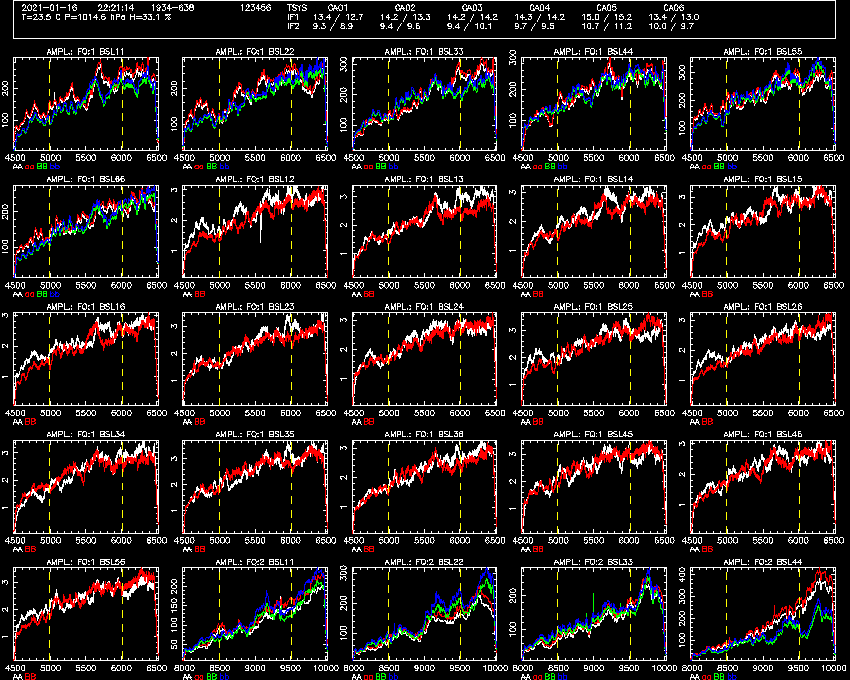
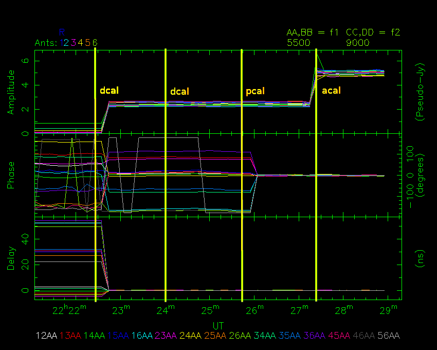

# Tutorial 1
An introduction to the software, and understanding online calibration.

## Goals of the tutorial

In this tutorial, you will learn:

* how to use [`rpfitsfile_server`](../../src/apps/rpfitsfile_server/),
  [`nvis`](../../src/apps/nvis/) and [`nspd`](../../src/apps/nspd),
* how the three applications interact with each other,
* what a typical 4cm CABB online calibration looks like.

After completing this tutorial, you will be able to use the tools to learn more
in the other tutorials.

## Getting the tools

We begin by getting and compiling the software. Instructions for doing this
are on the [front page](../../README.md) of this repository, under the "Installation"
heading. After you have successfully compiled the software, you can continue
this tutorial.

## Starting the tools for this tutorial

Open up three terminals. In one of these terminals, navigate to the path
`atca-training/tutorials/1_introduction` and in the other two go to
`atca-training/build`.

You should download the RPFITS file that we will use for this tutorial
from our website:
[2021-01-16_2220.C999](https://www.narrabri.atnf.csiro.au/people/Jamie.Stevens/atca-training-tutorials/1_introduction/2021-01-16_2220.C999). Put it into the
`atca-training/tutorials/1_introduction` directory.

From that same directory, start the `rpfitsfile_server` with the command:
```bash
../../build/rpfitsfile_server -n 2021-01-16_2220.C999
```

The server will load the data in the file over the next few seconds and output
something like the following to the terminal:
```
 $ ../../build/rpfitsfile_server -n 2021-01-16_2220.C999 
RPFITS FILE: 2021-01-16_2220.C999 (1 scans):
  scan 1 (1934-638       , ) MJD range 59230.931307 -> 59230.936747 (48 c)

Preparing for operation...
 grabbing from random scan 0 from file 0, MJD 59230.931423
[data_reader] checking for cached vis products...
[data_reader] no cache hit
[add_client_spd_data] making new client cache DEFAULT
[add_cache_spd_data] adding SPD cache entry for data at time 2021-01-16  22:21:15 with options:
Options set has 1 elements:
  SET 0:
     PHASE IN DEGREES: YES
     INCLUDE FLAGGED: NO
     TSYS CORRECTION: CORRELATOR
     # WINDOWS: 2
     --WINDOW 1:
        CENTRE FREQ: 5500.0 MHz
        BANDWIDTH: 2048.0 MHz
        # CHANNELS: 2049
        TVCHAN RANGE: 513 - 1537
        DELAY AVERAGING: 1
        AVERAGING METHOD: VECTOR MEAN
     --WINDOW 2:
        CENTRE FREQ: 9000.0 MHz
        BANDWIDTH: 2048.0 MHz
        # CHANNELS: 2049
        TVCHAN RANGE: 513 - 1537
        DELAY AVERAGING: 1
        AVERAGING METHOD: VECTOR MEAN
Configuring network server...
Creating socket...
Binding sockets...
   to (null)
Listening...
Waiting for connections...
```

When you see the `Waiting for connections...` output, you can start using the other
tools.

Let's begin by looking at the data with NSPD; this will give a basically unfiltered
view of the data that is coming from CABB. To do this, in one of the other terminals:
```bash
./nspd -d /xs -s 127.0.0.1 -u usr123
```

You should feel free to change `-d /xs` to use a different interactive PGPLOT device
if you'd like, and to change `-u usr123` to use a different username.

You should see a PGPLOT window open and look something like the image below. The
controlling terminal should have output something like:
```
 $ ./nspd -d /xs -s 127.0.0.1 -u usr123
client ID = Ij FH93YlB\R=Vame"H
Connected to SIMULATOR server.
NSPD> 
```

The terminal in which `rpfitsfile_server` is running will also update with more
information.



Finally, let's start up NVIS; this tool is used to see a more concise overview
of the data. To do this, in the last of the terminals:
```bash
./nvis -d /xs -s 127.0.0.1 -u usr123
```

Once again, you can change the PGPLOT device to whatever you want, but you should
make sure if you changed `-u usr123` for NSPD, do the same here for NVIS.

You should see another PGPLOT window open and look something like the image below.
The controlling terminal should have output something like:
```
 $ ./nvis -d /xs -s 127.0.0.1 -u usr123
Client ID = (Plwy@7=>RJw[c5{8BG
Connected to SIMULATOR server.
NVIS> 
```

Again, the `rpfitsfile_server` terminal should show some more output.


## Some basic usage

This data was taken during an online calibration process at the standard
4cm frequencies of 5500 and 9000 MHz. This can be most easily seen in NVIS.

The image below shows the same NVIS view as above, but annotated with the
times that each correlator calibration command was given; these times and
commands are:
Time       | Command
----       | -------
22:22:26   | dcal
22:24:03   | dcal
22:25:43   | pcal
22:27:23   | acal



This is pretty typical, so it will be instructive to take a look at how
the data changes after each command. To do this, we'll use NSPD.

At the top of NSPD is a small panel of information, including the timestamp
for the data being displayed, the name of the source being observed (in this
case "1934-638"), the weather conditions during the cycle, the antennas
which are on-source, and the system temperatures for each antenna, polarisation
and continuum IF.

When NSPD started, it will probably have shown you the data from 22:21:14,
which is actually the midpoint of the cycle that started at 22:21:10. The cycle
time for this observation was 10 seconds. So why is 22:21:14 the midpoint? That
is just a function of the way that NSPD displays the time; the actual midpoint
is 22:21:14.95 (because of a small period of blanking that happens during the
cycle), and NSPD doesn't round but rather just truncates the seconds.

To begin, ensure that NSPD is displaying the data from 22:21:14. If it isn't,
you can tell it to by giving the command:
```
get time 22:21:14
```

Your display should look like the NSPD image above. You can see 25 panels
in a 5x5 grid, with each panel showing the correlated amplitude for a different
baseline. Let's run through what we're seeing. In the top-left panel, we can
see that the title is "AMPL.: FQ:1 BSL11". This indicates that we are seeing
the amplitude from the first IF for the baseline formed by antenna 1 with antenna
1; this indicates that it's an autocorrelation (sort of). The X-axis goes from
around 4500 to 6500; this is frequency in MHz. The Y-axis is amplitude, which
in this case has units of what we call Pseudo-Jy; we'll explain this in a later tutorial.

In this panel we can see four lines of different colour, and the colour key is
at the bottom right of the panel, under the X-axis. These lines are labelled:
Label    | Meaning
-----    | -------
AA       | the auto-correlation of the X-pol while the noise diode is off
aa       | the auto-correlation of the X-pol while the noise diode is on
BB       | the auto-correlation of the Y-pol while the noise diode is off
bb       | the auto-correlation of the Y-pol while the noise diode is on

Because the noise-diode is on for aa, you will see that its line looks almost
exactly the same as for AA, but at slightly higher amplitude (the same for bb and BB).
We'll discuss the operation of the noise diode later.

The panels progress from left to right and then downwards. There are six panels
containing the autocorrelations from the six individual ATCA antennas. The
seventh panel has the title "AMPL.: FQ:1 BSL12", and only has two lines. The X-axis
and Y-axis are exactly the same as for the autocorrelations, although the Y-axis range
is significantly different (and lower). This panel is a cross-correlation between
antenna 1 and antenna 2. The lines are labelled:
Label    | Meaning
-----    | -------
AA       | the correlation of X-pol on the first antenna with X-pol on the second antenna
BB       | the correlation of Y-pol on the first antenna with Y-pol on the second antenna

There are fifteen cross-correlation panels, all of which look similar but none
of them identical to any other. Throughout these tutorials, we will go through
why these panels look the way they do, learning about the how the correlator works
and how to judge the health of the data along the way. Here's a few questions to
keep in mind as you go along; if you already know all the answers to these, you
probably don't need to keep doing these tutorials! (Actually, I hope these tutorials
will teach everybody something, but maybe not the early ones...)

* What's with the slope of the lines?
* Why do the lines drop off at the edges?
* Why are the Y-axis scales not identical?
* Why does the amplitude not match the flux density of 1934-638?

After the six autocorrelation panels, and the fifteen cross-correlation panels from
IF1, we get another four autocorrelation panels, this time from IF2; the X-axis
for IF2 has a different frequency range.

You can play around with how many panels are shown on a single plot with the
`nxy` command in NSPD. This works similarly to the way it works in SPD, although SPD
has a usable limit of 4x4, whereas NSPD's limit is 7x7. For example, you can show all
twenty-one of the products from IF1 only with something like nxy 3 7.