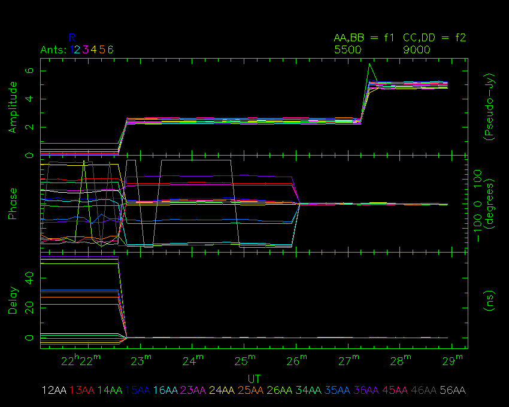

# Tutorial 1
An introduction to the software, and understanding online calibration.

## Goals of the tutorial

In this tutorial, you will learn:

* how to use [`rpfitsfile_server`](../../src/apps/rpfitsfile_server/),
  [`nvis`](../../src/apps/nvis/) and [`nspd`](../../src/apps/nspd),
* how the three applications interact with each other,
* what a typical 4cm CABB online calibration looks like.

After completing this tutorial, you will be able to use the tools to learn more
in the other tutorials.

## Getting the tools

We begin by getting and compiling the software. Instructions for doing this
are on the [front page](../../README.md) of this repository, under the "Installation"
heading. After you have successfully compiled the software, you can continue
this tutorial.

## Starting the tools for this tutorial

Open up three terminals. In one of these terminals, navigate to the path
`atca-training/tutorials/1_introduction` and in the other two go to
`atca-training/build`.

You should download the RPFITS file that we will use for this tutorial
from our website:
[2021-01-16_2220.C999](https://www.narrabri.atnf.csiro.au/people/Jamie.Stevens/atca-training-tutorials/1_introduction/2021-01-16_2220.C999). Put it into the
`atca-training/tutorials/1_introduction` directory.

From that same directory, start the `rpfitsfile_server` with the command:
```bash
../../build/rpfitsfile_server -n 2021-01-16_2220.C999
```

The server will load the data in the file over the next few seconds and output
something like the following to the terminal:
```
 $ ../../build/rpfitsfile_server -n 2021-01-16_2220.C999 
RPFITS FILE: 2021-01-16_2220.C999 (1 scans):
  scan 1 (1934-638       , ) MJD range 59230.931307 -> 59230.936747 (48 c)

Preparing for operation...
 grabbing from random scan 0 from file 0, MJD 59230.931423
[data_reader] checking for cached vis products...
[data_reader] no cache hit
[add_client_spd_data] making new client cache DEFAULT
[add_cache_spd_data] adding SPD cache entry for data at time 2021-01-16  22:21:15 with options:
Options set has 1 elements:
  SET 0:
     PHASE IN DEGREES: YES
     INCLUDE FLAGGED: NO
     TSYS CORRECTION: CORRELATOR
     # WINDOWS: 2
     --WINDOW 1:
        CENTRE FREQ: 5500.0 MHz
        BANDWIDTH: 2048.0 MHz
        # CHANNELS: 2049
        TVCHAN RANGE: 513 - 1537
        DELAY AVERAGING: 1
        AVERAGING METHOD: VECTOR MEAN
     --WINDOW 2:
        CENTRE FREQ: 9000.0 MHz
        BANDWIDTH: 2048.0 MHz
        # CHANNELS: 2049
        TVCHAN RANGE: 513 - 1537
        DELAY AVERAGING: 1
        AVERAGING METHOD: VECTOR MEAN
Configuring network server...
Creating socket...
Binding sockets...
   to (null)
Listening...
Waiting for connections...
```

When you see the `Waiting for connections...` output, you can start using the other
tools.

Let's begin by looking at the data with NSPD; this will give a basically unfiltered
view of the data that is coming from CABB. To do this, in one of the other terminals:
```bash
./nspd -d /xs -s 127.0.0.1 -u usr123
```

You should feel free to change `-d /xs` to use a different interactive PGPLOT device
if you'd like, and to change `-u usr123` to use a different username.

You should see a PGPLOT window open and look something like the image below. The
controlling terminal should have output something like:
```
 $ ./nspd -d /xs -s 127.0.0.1 -u usr123
client ID = Ij FH93YlB\R=Vame"H
Connected to SIMULATOR server.
NSPD> 
```

The terminal in which `rpfitsfile_server` is running will also update with more
information.


Finally, let's start up NVIS; this tool is used to see a more concise overview
of the data. To do this, in the last of the terminals:
```bash
./nvis -d /xs -s 127.0.0.1 -u usr123
```

Once again, you can change the PGPLOT device to whatever you want, but you should
make sure if you changed `-u usr123` for NSPD, do the same here for NVIS.

You should see another PGPLOT window open and look something like the image below.
The controlling terminal should have output something like:
```
 $ ./nvis -d /xs -s 127.0.0.1 -u usr123
Client ID = (Plwy@7=>RJw[c5{8BG
Connected to SIMULATOR server.
NVIS> 
```

Again, the `rpfitsfile_server` terminal should show some more output.



## Some basic usage

This data was taken during an online calibration process at the standard
4cm frequencies of 5500 and 9000 MHz. This can be most easily seen in NVIS.

The image below shows the same NVIS view as above, but annotated with the
times that each correlator calibration command was given; these times and
commands are:
Time       | Command
----       | -------
22:22:25   | dcal
22:24:03   | dcal
22:25:43   | pcal
22:27:23   | acal


This is pretty typical, so it will be instructive to take a look at how
the data changes after each command. To do this, we'll use NSPD.

At the top of NSPD is a small panel of information, including the timestamp
for the data being displayed, the name of the source being observed (in this
case "1934-638"), the weather conditions during the cycle, the antennas
which are on-source, and the system temperatures for each antenna, polarisation
and continuum IF.

When NSPD started, it will probably have shown you the data from 22:21:14,
which is actually the midpoint of the cycle that started at 22:21:10. The cycle
time for this observation was 10 seconds. So why is 22:21:14 the midpoint? That
is just a function of the way that NSPD displays the time; the actual midpoint
is 22:21:14.95 (because of a small period of blanking that happens during the
cycle), and NSPD doesn't round but rather just truncates the seconds.

To begin, ensure that NSPD is displaying the data from 22:21:14. If it isn't,
you can tell it to by giving the command:
```
get time 22:21:14
```

Your display should look like the NSPD image above. You can see 25 panels
in a 5x5 grid, with each panel showing the correlated amplitude for a different
baseline. Let's run through what we're seeing. In the top-left panel, we can
see that the title is "AMPL.: FQ:1 BSL11". This indicates that we are seeing
the amplitude from the first IF for the baseline formed by antenna 1 with antenna
1; this indicates that it's an autocorrelation (sort of). The X-axis goes from
around 4500 to 6500; this is frequency in MHz. The Y-axis is amplitude, which
in this case has units of what we call Pseudo-Jy; we'll explain this in a later tutorial.

In this panel we can see four lines of different colour, and the colour key is
at the bottom right of the panel, under the X-axis. These lines are labelled:
Label    | Meaning
-----    | -------
AA       | the auto-correlation of the X-pol while the noise diode is off
aa       | the auto-correlation of the X-pol while the noise diode is on
BB       | the auto-correlation of the Y-pol while the noise diode is off
bb       | the auto-correlation of the Y-pol while the noise diode is on

Because the noise-diode is on for aa, you will see that its line looks almost
exactly the same as for AA, but at slightly higher amplitude (the same for bb and BB).
We'll discuss the operation of the noise diode later.

The panels progress from left to right and then downwards. There are six panels
containing the autocorrelations from the six individual ATCA antennas. The
seventh panel has the title "AMPL.: FQ:1 BSL12", and only has two lines. The X-axis
and Y-axis are exactly the same as for the autocorrelations, although the Y-axis range
is significantly different (and lower). This panel is a cross-correlation between
antenna 1 and antenna 2. The lines are labelled:
Label    | Meaning
-----    | -------
AA       | the correlation of X-pol on the first antenna with X-pol on the second antenna
BB       | the correlation of Y-pol on the first antenna with Y-pol on the second antenna

There are fifteen cross-correlation panels, all of which look similar but none
of them identical to any other. Throughout these tutorials, we will go through
why these panels look the way they do, learning about the how the correlator works
and how to judge the health of the data along the way. Here's a few questions to
keep in mind as you go along; if you already know all the answers to these, you
probably don't need to keep doing these tutorials! (Actually, I hope these tutorials
will teach everybody something, but maybe not the early ones...)

* What's with the slope of the lines?
* Why do the lines drop off at the edges?
* Why are the Y-axis scales not identical?
* Why does the amplitude not match the flux density of 1934-638?

After the six autocorrelation panels, and the fifteen cross-correlation panels from
IF1, we get another four autocorrelation panels, this time from IF2; the X-axis
for IF2 has a different frequency range.

You can play around with how many panels are shown on a single plot with the
`nxy` command in NSPD. This works similarly to the way it works in SPD, although SPD
has a usable limit of 4x4, whereas NSPD's limit is 7x7. For example, you can show all
twenty-one of the products from IF1 only with something like nxy 3 7; that will look
like the image below.


But first let's compare what we see on NSPD with what NVIS shows. To highlight the
time that NSPD is displaying on NVIS, give NVIS the command `data 22:21:14`. You
should see a vertical blue dashed line appear on the left side of the plot, with
some purple cross-hatching to the left of it. Don't worry about the cross-hatching
for now, as we'll discuss that later.

At the time of the blue dashed line, all the amplitudes on NVIS are very small
(< 0.5 PS-Jy). But on NSPD all the amplitudes are much larger than this. This is
the case for all the "products" that NVIS displays, which you can run through
with the commands:
Command    | Products Displayed
-------    | ------------------
`sel aa`   | the cross-correlation of X-pol on the first antenna with the X-pol on the second antenna, in the first IF
`sel bb`   | the cross-correlation of Y-pol on the first antenna with the Y-pol on the second antenna, in the first IF
`sel cc`   | the cross-correlation of X-pol on the first antenna with the X-pol on the second antenna, in the second IF
`sel dd`   | the cross-correlation of Y-pol on the first antenna with the Y-pol on the second antenna, in the second IF
`sel ab`   | the cross-correlation of X-pol with the Y-pol of the same antenna, in the first IF
`sel cd`   | the cross-correlation of X-pol with the Y-pol of the same antenna, in the second IF

For each selection, the key between colour and product is shown at the bottom of the plot,
where each product is labelled something like `12AA`, where the first antenna is the first
digit, the second antenna is the second digit, and the polarisation letters should match
the table above (although capitalised). NVIS currently only shows two IFs at a time (like VIS),
and the currently selected IFs are shown at the top right of the plot, along with their
associated polarisation codes and central frequencies in MHz. These can be changed, and we'll
discuss that in another tutorial.

To make NSPD display the products called "AB" and "CD" in NVIS, you can include `ab` in
the NSPD select command: `sel aa bb ab`. For each of the autocorrelation panels, you will
see a blue line at the bottom. This is the correlated amplitude of the noise-diode signal.
Because the noise diode is designed to be roughly 5% of the system temperature of the
receiver, it can be difficult to gauge the amplitude on the same scale as the actual
autocorrelated signal. To examine the amplitude of the noise diode more closely, you
can either change the amplitude scaling (for all the panels) with `a 0 50`, or you can
select only the AB polarisation with `sel ab`. To reset the amplitude scaling, simply type
`a`, and to reset the selection, just give another `sel` command like `sel aa bb ab`.

Anyway, as you ran through the products in NVIS, you will have noticed that at 22:21:14, 
all the amplitudes are very small, and much less than are displayed on NSPD. So why is this?
You may notice that there are two vertical yellow dashed lines on every NSPD panel; these
lines show the range "tvchannels", with all the channels between the two lines being
included. The amplitude parameter shown in NVIS is a vector average of all the complex
data in the tvchannels. That is, the NVIS amplitude depends not only on the amplitude
of the raw data, but also its phase. Note also that I didn't say that the amplitude parameter
was the mean of all the data, but the average; we'll discuss this in more detail in another
tutorial.

Let's look at the phase in NSPD then, to see why it is causing the NVIS amplitudes to be
so low. To do this, give NSPD the command `p`. Let's also ensure you're looking at the phase
of the noise diode, with `sel aa bb ab`. The plot you see in NSPD now should look like the
image below.


In this mode, the Y-axis is phase in degrees, which can go between -180 degrees to 
+180 degrees. In each panel we can see varying rates of phase wrapping. For example,
the white AA line in the panel for baseline 1-4 is wrapping quite slowly, and the
phase does not fully wrap within the tvchannel range. The AA line for baseline 3-4
is wrapping slightly more quickly, and in the opposite direction to that seen in
baseline 1-4. And on baseline 1-6, it appears that the phase is wrapping so quickly
that it's difficult to discern any pattern.

We can also see that in NVIS while displaying the AA products, the line labelled
as "14AA" has the highest amplitude, followed by the line labelled by "34AA". This is
what we would expect for vector averaging; if the vectors (on the real-imaginary plane)
do not point in completely opposite directions, then there will be some bias towards
some direction, resulting in non-zero magnitude.

So is this the way it should look? Good question!

## Online calibration

To determine whether the data we're looking at is good, we have to first work out
what we expect it to look like. For this particular observation, the telescope is
looking at the source 1934-638, which is (for ATCA resolutions anyway) a point source
with a well defined flux density behaviour with respect to frequency, and a 
well-determined position.

Thinking about phase first, because it's a point source, we expect a plane wave to
hit all the antennas, with a delay between the wave hitting one antenna and another
determined entirely by the geometry of the array. Second, because we know its position,
we can direct our interferometer fringe patterns directly at the source, so that the
phase of the signal should be independent of baseline length, and thus independent of
frequency also. Thirdly, because it is a continuum source, it is generating waves at
all frequencies at the same time.

A simpler way of saying this is that we expect a continuum point source at the phase centre
to produce a frequency-independent signal with a single phase. This is definitely not
what we're seeing in NSPD at 22:21:14. Why not?

Looking closely at the behaviour of the phase, you can see that the phase appears
to vary linearly with frequency, and the slope of that line is degrees per MHz, or
seconds. This slope represents the combined delay error for each antenna and polarisation,
causing the wavefronts to be slightly misaligned at the correlator. These delay errors
are not due significantly to any geometry uncertainties, but rather to differences
in cable length, and timing differences between all the digitisers.

Back to NVIS now, we have panels for phase and delay. Phase is computed in the same
way as for amplitude, displaying the average value of the phase in the tvchannels
range. The delay (which as we've just discussed would be better labelled as
"delay error") is computed as the average value of the delay errors inferred by
looking at the phase changes between each pair of adjacent channels within the
tvchannels range. At 22:21:14, we
can again see the correspondence between what we see in NVIS and NSPD. For example,
the four baselines with the largest positive delay errors are 3-6, 4-6, 1-6 and
2-6, and they do appear to be wrapping far more often on NSPD than the other baselines.
Then we can see that the baseline 1-2 has only a small positive delay error, while the
baseline 1-3 has a similarly small negative delay error, and this is reflected in NSPD
where the phase is increasing with increasing frequency for baseline 1-2, and 
decreasing for baseline 1-3. You should run through all the IF 1 products available
in NVIS ("aa", "bb" and "ab") and check that you understand the correspondence between
NVIS and NSPD.

Looking at NVIS, we can see that something happens at 22:22:45, where the delay
errors go to 0, the amplitudes all increase and the phase changes. Let's look at
what the data looks like shortly after that time in NSPD, by giving it the command
`get time 22:23`. You might see something like the picture below (if you've
set NSPD up with the commands `sel aa bb ab`, `sel f1` and `p`).


Now the phase is not wrapping on any of the baselines, but it still has a slope
on some, while it's "flat" on most of them. Let's discuss what has happened here,
since it will give us a lot of insight as to how CABB works.
As stated in the table shown earlier in this tutorial, a "dcal" command was given at
22:22:25. At that time, CABB was accumulating data for the cycle between
22:22:20 and 22:22:30, and processing the data between 22:22:10 and 22:22:20.
However, CABB has already prepared the fringe rotation model for the next cycle
which will run between 22:22:30 and 22:22:40. Thus the first cycle that can
incorporate the new delay figures will run between 22:22:40 and 22:22:50, and
that's what we see in NVIS. You should remember this: if you give CABB a "dcal"
or a "pcal" command, the effect will not be seen in the next cycle, but only in
the cycle after that.

The top two rows of panels show a light blue phase line, and it looks very bumpy on
a couple of the antennas. This is the correlated phase of the noise diode between
the two receptors on each antenna. The noise diode is injected in between the
two receptors, but each receptor will respond to the signal slightly differently, and
thus the correlated amplitude and phase is not single-valued over the whole frequency
range. The same is true for the correlations between antennas. But the primary reason why
some antennas look bumpier than others in the NSPD plot is because of the narrower
Y-axis range on some panels. It is therefore sometimes more useful to plot only the
normal phase range so comparison between panels is easier, with `p -180 180`.

We can see then that the phase slope on the products involving antenna 3, and that
for the cross-correlations the slope is on the Y-pol but not the X-pol. Again,
this gives some insight to how CABB works. When the dcal command was given at
22:22:25, CABB calculated the delay corrections to be:
```
01-16 22:22:25:: CCOMMAND: 'dcal'
01-16 22:22:25:: DCAL 1A: Corrections: CA01=-2.02 CA02=-4.64 CA03=0.00 CA04=-1.32 CA05=-31.80 CA06=-54.22 nS
01-16 22:22:25:: DCAL 1B: Corrections: CA01=-15.91 CA02=-7.55 CA03=0.00 CA04=-4.37 CA05=-42.71 CA06=-111.05 nS
01-16 22:22:25:: DCAL 1AB:Corrections: CA01=7.08 CA02=-3.90 CA03(Ref)=-6.82 CA04=-3.76 CA05=4.10 CA06=50.02 nS
01-16 22:22:25:: DCAL 2A: Corrections: CA01=-13.26 CA02=30.98 CA03=0.00 CA04=-66.97 CA05=-31.37 CA06=-73.56 nS
01-16 22:22:25:: DCAL 2B: Corrections: CA01=-35.57 CA02=51.68 CA03=0.00 CA04=2.45 CA05=-77.86 CA06=-40.91 nS
01-16 22:22:25:: DCAL 2AB:Corrections: CA01=37.71 CA02=-5.31 CA03(Ref)=15.40 CA04=-54.52 CA05=61.87 CA06=-17.25 nS
```

As you can see, no corrections were made to CA03 for 1A, 1B, 2A or 2B. This is because
it was the "reference" antenna, and all delays are with respect to this reference. However,
there is also a delay between the two receptors on each antenna, which is measured by
examining the noise diode delay, and assuming that the noise diode signal should hit
the two receptors simultaneously. But again, we need a reference, and this time we
have a reference receptor, that being the X-pol receptor, and so we add delay to the
Y-pol receptor's signal. So the correlator is over-correcting the Y-pol of the reference
antenna. Why? It is a known bug, which only seems to occur in the first dcal after the delays 
have been reset to their defaults (with the "reset delays" correlator command).

Another thing you might notice on this display is the odd look of the 2-6 and 5-6 baseline
panels, where there are many vertical white strips of colour. This occurs because of a
different type of phase wrapping. In this case, the phase of the X-pol signals on these
baselines sits very close to -180 degrees. The natural bumpiness of this phase signal
over the frequency range sometimes makes the phase go to less than -180 degrees, which
is equivalent to the same phase + 360. Because we calculate the phase between -180 and 180
degrees, the phase appears to jump between the two extremes, causing the NSPD appearance,
even though the phase signal is no different to any of the other baselines.

