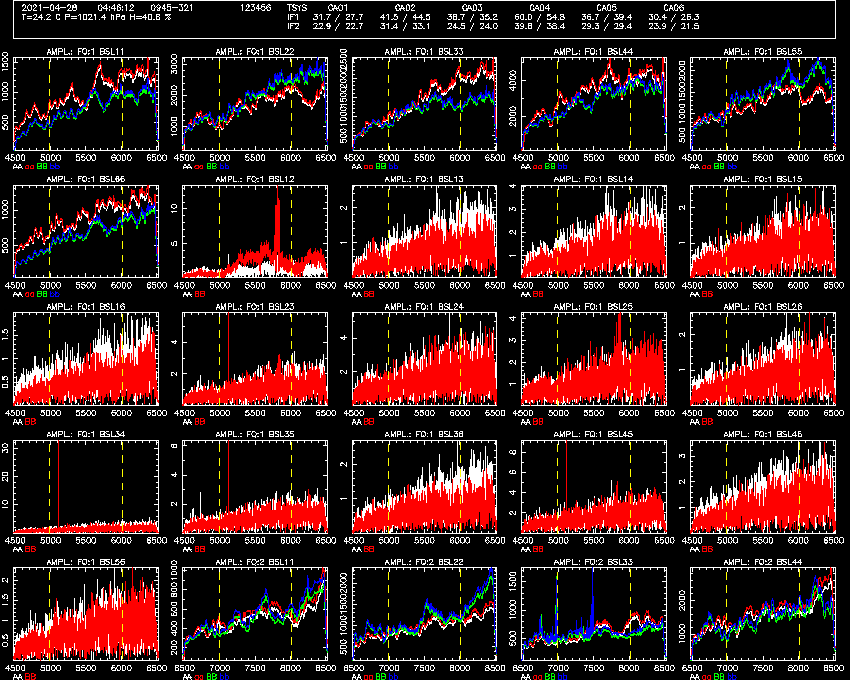
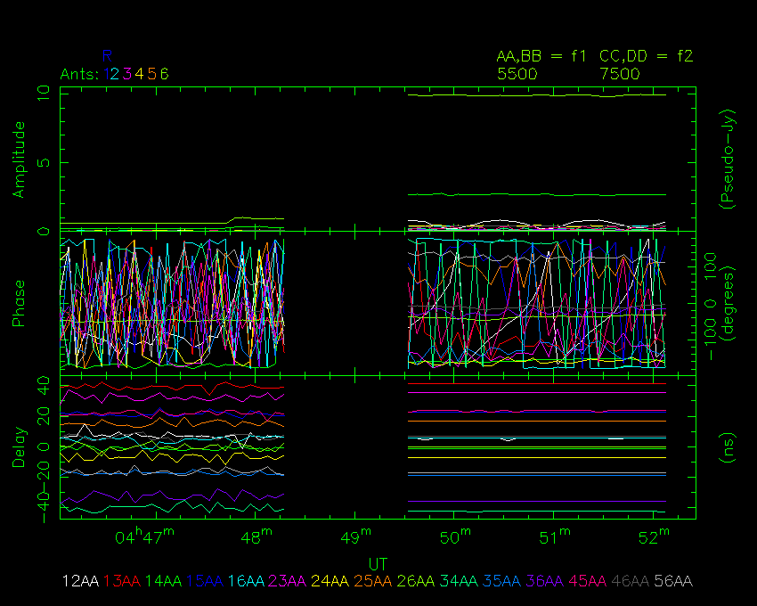

# Tutorial 2
A more detailed look at delay calibration.

## Goals of the tutorial

In this tutorial, you will learn how delay calibration works in more detail,
including the effects of different tvchannel settings, source flux density and
delay averaging.

## Starting the tools for this tutorial

It is assumed that you have already completed [tutorial 1](../1_introduction/) and
so have already obtained and compiled the tools.

Once again, we open up three terminals. In one of these terminals, navigate to
the path `atca-training/tutorials/2_dcal_and_delavg` and in the other two go to
`atca-training/build`.

You should download the RPFITS file that we will use for this tutorial from
our website:
[2021-04-28_0445.C999](https://www.narrabri.atnf.csiro.au/people/Jamie.Stevens/atca-training-tutorials/2_dcal_and_delavg/2021-04-28_0445.C999). Put it into the
`atca-training/tutorials/2_dcal_and_delavg` directory.

From that same directory, start the `rpfitsfile_server` with the command:
```bash
../../build/rpfitsfile_server -n 2021-04-28_0445.C999
```

When you see the `Waiting for connections...` output, you can start using the other
tools.

Start NSPD in one of the other terminals:
```bash
./nspd -d /xs -s 127.0.0.1 -u usr123
```

You should feel free to change `-d /xs` to use a different interactive PGPLOT device
if you'd like, and to change `-u usr123` to use a different username.

Start NVIS in the third terminal:
```bash
./nvis -d /xs -s 127.0.0.1 -u usr123
```

Once again, you can change the PGPLOT device to whatever you want, but you should
make sure if you changed `-u usr123` for NSPD, do the same here for NVIS.

At this point NSPD and NVIS should look something like the following two images.





## The observation

In this dataset, two sources were observed. From roughly 04:46 to 04:48:15 we
observed the source 0945-321 which has a flux density of about 323 mJy at 5.5 GHz,
and from about 04:49:30 until 04:52:10 we observed 0823-500, which has a flux
density of about 2.879 Jy at 5.5 GHz (a ~9 times higher flux density than 0945-321).

We are also observing with a 5 second cycle time, to really ensure that the
per-cycle signal-to-noise ratio of 0945-321 is low. At 5.5 GHz in 5 seconds, on
a single baseline, in a single 1 MHz channel, the ATCA RMS noise level is around
157 mJy.

