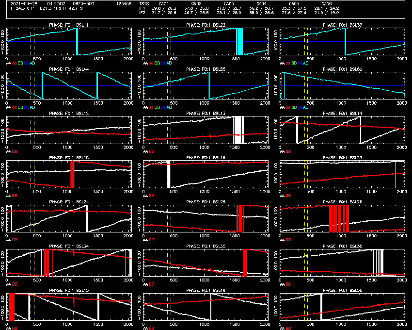

# Tutorial 2
A more detailed look at delay calibration.

## Goals of the tutorial

In this tutorial, you will learn how delay calibration works in more detail,
including the effects of different tvchannel settings, source flux density and
delay averaging.

## Starting the tools for this tutorial

It is assumed that you have already completed [tutorial 1](../1_introduction/) and
so have already obtained and compiled the tools.

Once again, we open up three terminals. In one of these terminals, navigate to
the path `atca-training/tutorials/2_dcal_and_delavg` and in the other two go to
`atca-training/build`.

You should download the RPFITS file that we will use for this tutorial from
our website:
[2021-04-28_0445.C999](https://www.narrabri.atnf.csiro.au/people/Jamie.Stevens/atca-training-tutorials/2_dcal_and_delavg/2021-04-28_0445.C999). Put it into the
`atca-training/tutorials/2_dcal_and_delavg` directory.

From that same directory, start the `rpfitsfile_server` with the command:
```bash
../../build/rpfitsfile_server -n 2021-04-28_0445.C999
```

When you see the `Waiting for connections...` output, you can start using the other
tools.

Start NSPD in one of the other terminals:
```bash
./nspd -d /xs -s 127.0.0.1 -u usr123
```

You should feel free to change `-d /xs` to use a different interactive PGPLOT device
if you'd like, and to change `-u usr123` to use a different username.

Start NVIS in the third terminal:
```bash
./nvis -d /xs -s 127.0.0.1 -u usr123
```

Once again, you can change the PGPLOT device to whatever you want, but you should
make sure if you changed `-u usr123` for NSPD, do the same here for NVIS.

At this point NSPD and NVIS should look something like the following two images.


## The observation

In this dataset, two sources were observed. From roughly 04:46 to 04:48:15 we
observed the source 0945-321 which has a flux density of about 323 mJy at 5.5 GHz,
and from about 04:49:30 until 04:52:10 we observed 0823-500, which has a flux
density of about 2.879 Jy at 5.5 GHz (a ~9 times higher flux density than 0945-321).

We are also observing with a 5 second cycle time, to really ensure that the
per-cycle signal-to-noise ratio of 0945-321 is low. At 5.5 GHz in 5 seconds, on
a single baseline, in a single 1 MHz channel, the ATCA RMS noise level is around
157 mJy.

We're going to use these two different sources to explore delay calibration
strategies.

## Delay errors, in depth

Let's begin by examining the delay errors observed on 0823-500, which is
a normal thing to do in
the 4cm band when 1934-638 is not available. In NSPD, look at the time 04:51
with `get time 04:51`. You should see NSPD display the timestamp 04:51:02,

Normally, when preparing for delay calibration, we will look at phase. Let's
configure NSPD to show us all of our IF1 phases with `nxy 3 7` and
`sel aa bb ab` and `p -180 180`. You will see that the phases are "wrapping"
at different rates on different baselines and polarisations, but that the
phase itself is quite well defined in each channel to make it look like
a sawtooth pattern. You can zoom in on a smaller channel range if you'd like
to confirm this is the case on the products where the phase is wrapping more
rapidly.

You should see much the same thing if you look at IF2 with `sel f2`, although
the wrapping rates will not necessarily be anything like what you saw in IF2.
This is because both IFs are, after the first conversion stage, completely
independent of each other.

In [tutorial 1](../1_introduction/) we talked about how the change of phase
with frequency is due to a delay error being present when the correlator
was doing its fringe rotation. Let's take a quick look at how that works
mathematically. For any particular time period &Delta;t, that represents
some amount of phase &Delta;&#981; for a wave with some frequency &nu;.
For example, 1 ns of time is a full period of a wave with frequency 1 GHz, and
a full period is 2&#960; radians.
The relationship here is &Delta;&#981; = 2&#960;&nu;&Delta;t.

To get the rate of change of phase with frequency, differentiate; here we dispense with
calling phase &Delta;&#981; since phase can have any zero point that we like.
So &part;&#981; / &part;&nu; = 2&#960;&Delta;t, and rearranging we get
&Delta;t = (1 / 2&#960;) &part;&#981; / &part;&nu;.

The correlator calculates this &Delta;t for each pair of adjacent channels
in the tvchannel range, and then takes the average value of all these pairs as
the delay for each baseline and polarisation product. Looking at the NSPD plot
of the wrapping phase of 0823-500 we can see a very regular pattern of phase
vs frequency, but if you look closely (for example at the AA phase on baseline
1-4 in IF1), you will see that there are deviations
away from perfect linearity. These are caused because the response of each
channel is not exactly the same; this is something that gets calibrated out
when you solve for the bandpass function early in your reduction process.
This is why it is better to have a wide tvchannel range for your delay
calibration, so that any local deviations are diminished in importance by the
averaging process, and thus you get a better estimate of the actual delay
error.

You can look at the range of delays that are computed between all the pairs
of adjacent channels using the **delay** command in NSPD. For example, let's
look at F1 with `sel f1` and then `delay`. The display will look something like
the picture below.


This is a feature that isn't available in SPD, it's just here to aid
understanding. Now each panel only has 1023 points on the x-axis, which is the
number of adjacent pairs present in the standard tvchannel range of 513 - 1537.
The curved "lines" visible in each panel are actually clouds of points, with
each point being a computed delay error (the y-axis is delay error in ns).
The points are plotted in ascending
order from the left of the panel to the right, so that the x-coordinate of each
point is not at all representative of where the pair of points were within the
tvchannel range. Not surprisingly, most of the points for each polarisation and
baseline lie within a narrow range of y-values, but there are also low-value and
high-value tails. Why do you think the delay error distributions all look like
this?

There are also horizontal lines for each polarisation and baseline, and these
represent the mean value for the points (the solid line) and the median value
(the dashed line). For most of the products, these lines are so close to each
other (again, not surprising) that they can't be distinguished. You should notice
though that a few of the horizontal lines do appear separated. When the
correlator parameter **tvmedian** is off, the mean value is returned as the
delay error, while if it is on, the median value is returned.

What we want while doing the delay calibration is that the value for the delay
error computed by the correlator is as accurate as possible. One indicator
of the accuracy of the value is stability. Looking at NVIS again, we can see that
for most of the AA baselines the delay value does not noticeably change over
time while the telescope is observing 0823-500. This is also a good example of
what we mean by "flat delays". Often you may hear the instruction "make sure your
delays are flat for at least 3 cycles before doing a dcal"; this just means that
the delay values don't change over time.

However, there are some baselines where the value is not the same every cycle.
Does that matter? We'll see later in this tutorial. For now though, we'll
figure out the reason for the deviations, and adjust as required.

So what's going on here? To work it out, look at the NVIS lines that show the
non-flat delay errors. In AA, it looks like the 1-2 and the 4-5 baselines have
small deviations at various times. Now let's look at these baselines in NSPD.
I doubt you'd see much while looking at phase, but if you look at amplitude (`a`),
you will probably notice that these two baselines (which happen to be
the two shortest baselines in this array configuration; use `sort` in NVIS to
illustrate this) have a large spike (> 60 pseudoJy) just below 5600 MHz.

While we're on the subject, and while you've got the baselines sorted in length
order, take a look at the effect of this RFI in NSPD as a function of
increasing baseline length. You'll probably conclude that shorter baselines
are more affected by RFI, at least for the RFI present in this observation. Why?
There are two primary reasons. First, for some reasonably close-by and
presumably stationary emitting source, what the ATCA antennas see will depend
on where they are, as the source will likely be emitting non-isotropically, and
there will be reflections etc. So the closer two antennas are to each other, the
more the RFI signal will look the same to both antennas, and the correlation
will be stronger. Second, the ability to discern a stationary signal from one
which is rotating with the sky is better on longer baselines, as the fringe rotation
required for longer baselines is much larger. Another way to put this is: does
the time delay between the RFI signal hitting the two antennas match that of an
astronomical signal? In this case you need to consider the effect of the delay
over the entire cycle integration time: for a short baseline, or a short cycle time,
the RFI signal will appear to match the geometry of the astronomical observation,
and will thus appear in the correlation. Can you think of another situation where
this match can occur?

OK, back to the data. In this case, the RFI signal is polluting several channels
(17 channels by my count). Zoom in on these channels in NSPD (`chan f1 1080 1120`
will do a decent job) to confirm this. Now switch back to looking at phase, and notice
how the linear behaviour of phase with frequency changes in the RFI-affected
channels. Have a look at a few cycles (use `back` and `forward` in NSPD to get
data from the previous or next cycle respectively) to see how the RFI phase changes.
This is why the delay error is not always consistent for every cycle, because
occasionally the RFI phase changes in a way significant to the delay computation.

What should we do about it? The easiest thing to do is select tvchannels which do
not contains the RFI. In this case, we know the RFI is in channels 1080 - 1120,
which is within the normal tvchannel range of 513 - 1537. Let's first select
a narrower range, by setting the tvchannels to 513 - 1070 (`tvch f1 513 1070`
in either NSPD or NVIS). What happens to the delay errors displayed in NVIS?
You should see something like the picture below.


The little delay error "blips" have gone on some baselines, but have been replaced
by blips on others, albeit smaller. This could be because of other RFI, or
it could also just be because now we have fewer channels in our tvchannels, and
thus the expected noise level for the mean value is higher than it was previously.
Try putting more channels in the range, with `tvch f1 200 1070`. That should
improve the situation, but it still doesn't look perfect.

The other option might be to use median averaging instead of mean to lessen
the effect of the RFI. Change back to default tvchannels with `tvch f1 513 1537`
and then turn on median averaging with `tvmedian on` (in either NSPD or NVIS).
The display should look like the picture below.


Now there doesn't appear to be any blips, but none of the lines are particularly
flat. This isn't too surprising, since the noise on a median average value is
larger than for the mean value. For example, if we assume the distribution of delay errors
is Gaussian, and we draw 1023 random values from the distribution, and we do
this 30 times, the variance on the 30 median values will be ~78% higher than
the variance on the mean values.

Let's summarise this section. You should now understand how the correlator
is calculating the delay errors from the phase information, and what is plotted
in the NVIS delay panel. You now also know about a couple of ways to direct the
delay calculations to change what is displayed in NVIS: **tvch**an and **tvmed**ian.
And you've seen how RFI can affect the delay error calculations.

## Correcting the delay

All this information is useful for when it comes time for your own observation,
and you need to correct the delays. In this section we will explore how to do
that, and what affects the success of delay calibration.

But let's cut to the chase: we're going to be correcting the delay errors in this
data. We can do so completely successfully immediately, just to see what a good
delay calibration should look like. To do so, quit out of everything (pressing
ctrl-c in the server terminal will cause NSPD and NVIS to exit automatically),
and then restart them in the same way as we did earlier. This is to ensure
all the settings go back to their defaults.

Then, in NSPD:
```
NSPD> get time 04:52
NSPD> sel aa bb ab
NSPD> p -180 180
NSPD> nxy 3 7
```

And in NVIS:
```
NVIS> data 04:52
```

You will see a vertical dashed blue line appear on the NVIS display, along with
a cross-hatched purple area. This purple area covers three cycles of data, with the
cycle closest to 04:52 being the latest of these cycles. These three cycles will be
used to calculate the appropriate delay corrections required. While observing for
real, the correlator will always use the most recent three cycles to calculate the
corrections (although as we will see later, the number of cycles can be changed).

Now, to correct the delays, type `dcal` into NVIS. You should see the following
output:
```
NVIS> dcal
 BAND 1, MJD 59332.202690 - 59332.202806:
   ANT 1: X = 0.000 Y = 0.000 XY = 61.747 ns
   ANT 2: X = 5.819 Y = -110.607 XY = -54.664 ns
   ANT 3: X = 41.057 Y = 23.260 XY = 43.956 ns
   ANT 4: X = -1.252 Y = -62.857 XY = 0.143 ns
   ANT 5: X = 22.437 Y = -66.503 XY = -27.188 ns
   ANT 6: X = 5.574 Y = -56.939 XY = -0.772 ns
 BAND 2, MJD 59332.202690 - 59332.202806:
   ANT 1: X = 0.000 Y = 0.000 XY = 49.395 ns
   ANT 2: X = -95.704 Y = -158.251 XY = -13.173 ns
   ANT 3: X = 25.897 Y = -23.745 XY = -0.236 ns
   ANT 4: X = -1.054 Y = -58.136 XY = -7.675 ns
   ANT 5: X = 10.681 Y = -23.703 XY = 15.016 ns
   ANT 6: X = 6.031 Y = -56.329 XY = -12.958 ns
```

The server will begin recomputing the data with these delay corrections applied,
and when it has finished, NVIS and NSPD should look like the pictures below.


A lot just happened, so let's go through it.

How did we determine the delay errors? NVIS did that by looking at all the
baselines that were formed with the reference antenna. So we state that
all the delays are relative to when the wavefront hits CA01, and do not
add any further delay to that antenna. Then, the delays measured on the baseline
1-2 (for each polarisation and IF) are the delay errors for CA02, etc.

NVIS then measures the delay error between the X and Y pols on each antenna by
looking at the noise diode signal, and this becomes the XY delay correction.

How did we correct the data? When the server computes the phases from the raw
complex data, it incorporates the delay corrections supplied by NVIS. For the
baseline formed between polarisation m on antenna i and
polarisation n on antenna j (where i < j), the delay that needs to be added
is that between the reference antenna and antenna j for pol n, minus the
delay between the reference antenna and antenna i for pol m.

Then, for each frequency channel, the server computes how many wavelengths that
delay would represent, and converts this into an angle. Then it rotates the
raw complex number (let's call that R) in each channel by that
angle (let's call it &phi;), by multiplying R * (cos(&phi) + i sin(&phi)).
The result is the delay-corrected complex value, which can then be used to
calculate phase and amplitude and all the averaged parameters.

In NSPD, the phase is very similar in all of the frequency channels on any
particular baseline and polarisation product; that is, the slope on the phases
is now very close to 0. This translates into a very small delay error in NVIS in
the three cycles that were corrected by the dcal.

In these same three cycles, the NVIS amplitudes and phases change quite
considerably as well. The phases become stable with time, and the amplitudes
become higher. If you look at the amplitudes in NSPD for a cycle that has been
corrected, and for a cycle which hasn't, you won't notice much difference.
Remind yourself why the NVIS amplitudes change here, if you don't remember,
by going back to [tutorial 1](../1_introduction/).

OK great, we've seen how to do a perfect dcal. Let's recap:
* Look at a source with a high flux density.
* Confirm in (N)SPD that there is a slope in the phase across
  the band; as we'll see later, (N)VIS delay errors can be misleading.
* Wait for three cycles of data where the delay errors in (N)VIS aren't
  significantly changing; if you need to, change the tvchannel range to
  avoid RFI, or change the averaging method.
* Do a dcal.

Anybody who has been trained
in how to operate ATCA will have been shown how to do this, and seen it work.

But it isn't very instructive, as it leaves a lot of questions unanswered.
* Under what conditions won't it work?
* What do I do if it hasn't worked?
* What if I can't look at a source with high flux density?
* Does it matter if I need to do more than one dcal?

So let's continue our examination of delay calibration.

## RFI

Begin by resetting the delays, by giving the command `reset delays` in
NVIS. (By the way, this can also be done during real observing, in CACOR,
to get back to the default delay correction if you've accidentally caused
decorrelation to occur.)

Now we'll try to calibrate using some cycles that are RFI-affected. In NVIS,
`data 04:50:32` will select the cycle that has the biggest blip in delay error
on baseline 12AA. If we were to give the command `dcal` now, NSPD would not
update to show the effect since the cycle it is displaying is outside the three
cycles that end at 04:50:32. So instead, let's give the command `dcal after` in
NVIS. This will make the software work in basically the same way as CACOR, where
all the data after the last cycle selected by `data` is delay calibrated.

If you look at IF1 in NSPD for a cycle after 04:50:32, you'll see something
that looks like the picture below.


The delay calibration has made the situation quite a lot better, and for the
autocorrelations it has worked exactly as well as before.
But the phases from boths pols on antenna 2 still have a significant slope across
the band. Compare the delay corrections NVIS made for this dcal to that for
the last dcal, and you'll notice that last time the CA02 X-pol delay error was
calculated to be 5.819 ns, whereas now it was 5.172 ns; for Y-pol it was
-110.607 ns last time, and -110.919 ns this time. All the other delay
errors are the same to better than 0.021 ns.

Why did CA02 not work perfectly? It's because the delay on baseline 1-2 was
most affected by RFI, and antenna 1 was the reference antenna. Since the
delay corrections are computed by looking only at the baselines formed with
the reference antenna, the correction for CA02 was incorrectly computed.
So what do you think will happen if CA02 was the reference antenna instead?
Try it out!
```
NVIS> reset delays
NVIS> refant 2
NVIS> dcal after
```

Now you should see that CA01 phases have a residual slope instead of CA02.
Since all other antennas were corrected properly with either
CA01 and CA02 being the reference antenna, using any other antenna as the
reference should work fine right? Of course, you should test this contention.
If you try with CA03 or CA06 as reference, you will find this to be the case. But
if you try with CA04 or CA05 as the reference, then either CA05 or CA04 will
have a phase slope because the baseline 4-5 was also affected by RFI.

So you can avoid RFI by selecting a reference antenna which isn't part of any
baseline that is affected by RFI. Since long baselines are less affected by RFI,
why wouldn't we always use CA06 as the reference antenna? While you're observing,
raw data from all the antennas is streaming in to the correlator at a very high
rate, and the correlator has to have a buffer for all this data because the
data is coming from the different antennas with different delays due to cable
lengths, and the geometric delays are always changing as the Earth rotates.
The memory for the buffer is of course limited, so we can't just allow for any
possible amount of delay. The buffer is optimal used when the delay
zero point is towards the centre of the track. That isn't to say you can't use
CA06 as the delay reference antenna, and indeed in most cases it won't be an
issue. However, in some circumstances, when the reference antenna is changed
to and fro, or when multiple dcals are performed and digitisers are reset,
or if dcals are done on opposite sides of the sky, the delay required gets
driven towards the edge of the buffer and can cause decorrelation for some
large hour angles. The best way to avoid this problem is to reset delays
before doing a dcal, especially if you're changing the reference antenna.
Or just leave the reference antenna as one of the track antennas, usually CA03.

At this point you should play around with the tools, choosing different
tvchannel ranges, different reference antennas and different calibration
times, to see what does and doesn't work very well. Remember to `reset delays`
between each attempt.

## Bandpass shape, and the two-step dcal

Sometimes you might be forced into using a small bandwidth range to do your
initial delay calibration. This can happen at 16cm where you need to avoid
RFI, and in 64 MHz zooms mode. These cases will both be covered in future
tutorials. Here though we'll investigate it from a more general way.

As we said earlier in this tutorial, there are deviations away from perfect
linear phases across the band. This is due to how different frequencies are
received by the antennas. Over wide frequency ranges, the response is
the same on-average, but this is not the case in very small ranges. Let's
look at that now, by doing a normal delay calibration first. Set it up
with:
```
NVIS> reset delays
NVIS> refant 3
NVIS> tvch f1 513 1537
NVIS> tvch f2 513 1537
NVIS> data 04:51
NVIS> dcal after
```
and
```
NSPD> get time 04:52
NSPD> sel f1
NSPD> p -180 180
```

You will see the phases go flat across the band, as before. Let's zoom in to
a small range in NSPD with `ch f1 400 500`. You will see that in this range
on some IF 1 baselines and pols, the phase doesn't appear to be flat. Let's try
to dcal with a small range then:
```
NVIS> reset delays
NVIS> tvch f1 400 450
NVIS> dcal after
```
and
```
NSPD> ch
```

Now you will see something that looks like the picture below.



There is still a residual delay error across the wide band, but in the
tvchannels (as outlined by the vertical dashed yellow lines), the phase does
indeed look pretty flat, just as we would expect. From this point, you could
expand your tvchannel range, and redo the dcal and get a better result.

Since we've already seen that we can make a good delay calibration in a single
step with this data, this example serves only to show clearly how the phase
can vary in localised ranges within the wider band. As I said before, future
tutorials will expand on this in situations where you don't have any other
choice but to do it this way.

## Delay averaging and the hazards of aliasing

Up until now you may have been wondering why we even observed the source
0945-321, as we have done nothing with it. We're going to use it now, to
illustrate one use of the **delav**g parameter, which will come in handy for
sources with low signal-to-noise.

Begin by resetting the delays, and setting tvchannels back to their defaults,
and take a good look in NVIS at how the
delay errors computed for 0945-321 compare to those computed for 0823-500.
You'll notice that the order of baselines and polarisations (as in from large
negative errors to large positive errors) is pretty much the same, although
the magnitudes don't always exactly match, and there's a lot more variation
in time.

Look at the data in NSPD with `get time 04:48`. You'll see that you can
still see the phase wrapping, but again, the phase signal will appear more
noisy than it did on 0823-500.

Let's first answer the question: "If we calibrate the delay errors on 0823-500,
does the phase become flat on 0945-321?" That's easy to check. Select a time
in NVIS that will allow you to successfully dcal on 0823-500, and then instead
of doing `dcal after`, do `dcal all`. You will see in NSPD that the phases
do become flat, and NVIS will look similar to the picture below.


The noise on the delay errors here is the same as it was before the dcal.

The next question is then: "What happens if you try to calibrate the delay
errors using 0945-321?" Before you do it, try to predict what will happen.
You'll see something similar to the picture below:


Note how the y-axis scaling on the delay panel is basically the same
regardless of which source is used for the dcal, and it's dominated by the
noise on 0945-321. When 0945-321 is used though, there are residual
delay errors on 0823-500 and all these residual errors are within the noise
range of 0945-321. Clearly then, the noise level is the limit for how
accurately the delays can be corrected.

OK, so don't use sources with low flux density, right? While you'll almost
always have a choice of a more fluxy source, maybe the antennas would take
a long time to point at it, or its at low elevation, or some other reason
why you might want to use a lower flux density source. So what do we do?

With the delay calibration from 0945-321, this is what NSPD might look like.


It's obvious that we could fit a line to the phase slopes; if only the noise
was lower we could get a good delay calibration. This is where the **delav**g
parameter comes in. Go back to NSPD, and give the command `show av`. You will
see another few colours appear in the legend below each plot, which will be
labelled with the same polarisation codes but with "v" appended; these are
the lines as averaged by **delav**g channels. At the moment, delavg is 1, so
the new lines will be identical to the unaveraged data. But let's change delavg
to 2, with `delavg 2` in NSPD. Now NSPD and NVIS will look something like this:


In NSPD, the pink and yellow lines are now clearly within the white and
red lines, but they are still noisy. And in NVIS, the delay error lines on
0945-321 look like they're actually at similar values to the same lines
on 0823-500.

What's happened here? When using delavg greater than 1, phase channels are
averaged together before measuring the delay between adjacent sets of
averaged channels. Here, with a delavg 2, the phase that is used to calculate
delays comes from 2 MHz averaged channels; with a tvchannel range of 513 - 1537,
instead of having 1023 individual delays, we only calculate 511. You can see
this if you look at `delay` in NSPD. However, these averaged channels are
used only for delays; the phase and amplitude displayed in NVIS do not change
with delavg. If the averaged channels were used for amplitude and phase, how
do you expect them to change?

We've obviously improved the situation with the delay errors in NVIS, but they
are still too noisy to be usable. Try increasing the delavg parameter until the
delay lines in NVIS look flat enough to do a successful dcal (it is traditional
to use powers of two for delavg, but it is not limited to that). Remember to
compare the delay errors determined on 0823-500 to those determined on 0945-321.
Feel free to `dcal` to check if delay calibration is successful, but remember
that if you need to `reset delays`, that will remove all previous delay calibration,
so you will need to redo the first step each time.

What you will find is that delavg of 8 will allow you to do a pretty successful
delay calibration, but that delavg of 16 will not work very well. 
