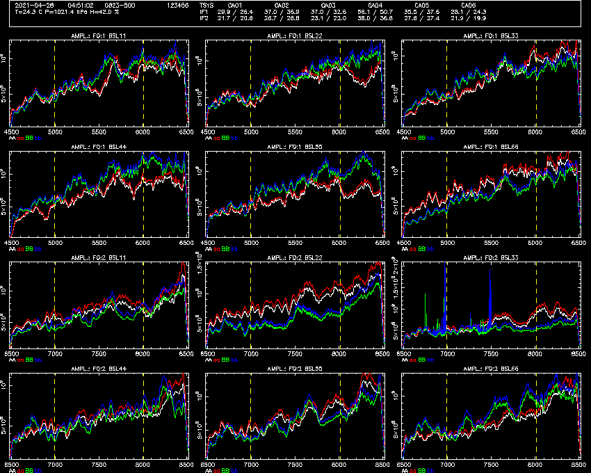

# Tutorial 3
A look at amplitude calibration, how it works, and its effect on
system temperatures.

## Goals of the tutorial

In this tutorial you will learn how amplitude calibration works in CABB,
and how system temperatures are set through this process. You will learn
how to do this calibration as correctly and consistently as possible,
and how best to avoid some of the potential pitfalls.

## Starting the tools for this tutorial

It is assumed that you have already completed both [tutorial 1](../1_introduction/)
and [tutorial 2](../2_dcal_and_delavg/), and so have already obtained and
compiled the tools.

Once again, we open up three terminals. In one of these terminals, navigate to
the path `atca-training/tutorials/2_dcal_and_delavg` and in the other two
go to `atca-training/build`.

Since you have already completed [tutorial 2](../2_dcal_and_delavg/), you should
already have downloaded the RPFITS file that we will use for this tutorial. As
noted above, we will operate out of that tutorial's directory, so start
the `rpfitsfile_server` with the command:
```bash
../../build/rpfitsfile_server -n 2021-04-28_0445.C999
```

When you see the `Waiting for connections...` output, you can start using
the other tools.

Start NSPD in one of the other terminals:
```bash
./nspd -d /xs -s 127.0.0.1 -u usr123
```

You should feel free to change `-d /xs` to use a different interactive PGPLOT
device if you'd like, and to change `-u usr123` to use a different username.

Start NVIS in the third terminal:
```bash
./nvis -d /xs -s 127.0.0.1 -u usr123
```

Once again, you can change the PGPLOT device to whatever you want, but you
should make sure if you changed `-u usr123` for NSPD, do the same here for NVIS.

At this point NSPD and NVIS should look something like the following two
images.


## The observation

In this dataset, two sources were observed. From roughly 04:46 to 04:48:15
we observed the source 0945-321 which has a flux density of about 323 mJy
at 5.5 GHz, and from about 04:49:30 until 04:52:10 we observed 0823-500,
which has a flux density of about 2.879 Jy at 5.5 GHz (a ~9 times higher
flux density than 0945-321).

## Initial look at the data

Immediately we can see that the flux densities of the two sources, as
they appear in NVIS, do not match those just quoted. After the previous
two tutorials, you should understand that at this point there is a lot of
decorrelation due to the way vector averaging works with data that is not
delay calibrated. So you should start by delay calibrating all the data, and
then you should see that NVIS looks something like the following:


You should notice a few things about the amplitudes at this point.
First, they're clearly much higher than we think they should be. Second,
the amplitudes on each baseline don't agree with each other very well.
Third, it looks like the amplitude for 0945-321 increases at about 04:47:45.

We know that both sources are point-like, so the amplitudes should be
consistent across all the baselines. We also know that they are unlikely
to change their flux densities suddenly. So why does NVIS appear the way it
does? Figuring that out will reveal more details about how CABB works, and
why. Having this knowledge should help you when you are observing or doing
data reduction.

## CABB's amplitude correction model

Let's begin by describing what's going on in the correlator, in a
less-technical way than we will later.

The data coming from each antenna into the correlator is simply a stream
of voltages over time. When each antenna is pointing at the same patch
of sky, one might expect that this stream would look very similar on each
antenna, with random noise variations being the main difference, but this
is not necessarily the case. Even in a homogenous array like ATCA, the
equipment on each antenna is not really identical, and that's before we
start to consider controllable attenuators and differences in age and
the time since different parts were tuned or replaced.

When the time comes for the correlator to multiply the data from one
antenna with another, it cannot be assumed that the individual antennas
share the same voltage scaling. So what comes out of the multiplication?

Let's think about what we want the result to be. Imagine an empty patch
of sky, except for a point source with some known flux density at a
well-defined position. We've told our correlator to correct for delays
and phases towards that point source. In this case, we want each channel
of our cross-correlation to represent the flux density of the point
source in that frequency channel, with a phase of 0 because it's positioned
at the phase centre. But for that to be true, both antennas have to agree
on the flux density that they are looking at, and this is the aim of
amplitude calibration.

So how do we ensure this to be the case? Like a lot of things in radio astronomy,
it comes down to comparisons with known standards. We begin by pointing
at a source with some known flux density, and calibrate our antennas
against this. Then, when we observe some other source with an unknown
flux density, we simply assume that the system has a linear response to
flux density such that if a source had twice the amount of flux density,
the system would produce twice the response compared to the standard.

Sounds easy, and it is, so long as the system stays perfectly linear between your
observation of the flux density standard, and your observation of the
target. However, that is rarely the case, because the response of the
system depends on so many things: the atmosphere between the telescope
and the source, effects of pointing elevation on the reflector shape,
shifts in antenna focus, etc.

We can group most of these types of changes into a single parameter though:
system temperature. The basic idea is that an instrument with a lower
system temperature is more sensitive, and thus will produce a larger response
to the same input. If we keep track of the system temperature of the
instrument, we can compensate for the non-linearity caused by changes in
sensitivity, and recover the linear response we require for precision
measurements.

This is best expressed as the "system equivalent flux density", which is
the flux density of a source which would double the response of a system.
Imagine that when you look at a completely empty patch of sky, your
instrument produces an output of *A*, but when you observe a source with a
flux density of *S* Jy, your instrument produces an output of *2A*; in
this case, your system equivalent flux density (SEFD) is *S* Jy. You can
see then, that if for some reason your SEFD increased to *2S* Jy, that same
source would only increase the output by 50%, instead of the 100% increase
it generated while your SEFD was *S* Jy.

Ideally then, we want to continually assess what our SEFD is during
our observations. We could repeatedly go back and observe the same
standard flux density calibration source, but that adds a great deal of
overhead. What would be better is if we could carry around a source with
known flux density, and continually observe how much the system responds
to that source, even while we're looking at other sources. And, for the
ATCA, we do have such a system: the noise diode.

On each antenna, for all bands except for 3mm, we have installed a
broadband noise source which is engineered to be very stable over the
typical timescales for observing. This noise source is switched on and
off 8 times per second, and the correlator monitors the data to continually
assess the effect the noise diode has, and compute the current system
temperature for each cycle. The correlator then scales the data
by the computed system temperature, to keep the system linear.
Thus it is important to calibrate the
amplitude of the noise diodes, so that the monitoring is as accurate as
possible; this is what the amplitude calibration process does.

## A look at the data

Let's take a closer look at the data in NSPD. Configure it to view only
the auto-correlations for both IFs, view 0823-500, and set an amplitude
scale which keeps all the data in view. The following commands will do
that, but feel free to go with your own solution.

```
NSPD> off ccs
NSPD> get time 04:51
NSPD> nxy 3 4
NSPD> a 100 6500
```

You will see something that looks like the following image.


This illustrates quite well the idea that each antenna is on a
different scale. Consider CA04, which has a much higher amplitude
than all the other antennas in both IFs. You might think this is
because the antenna is generating more noise than the other antennas, but
look more carefully at the red and white lines. The red line is the
power in the X polarisation while the noise diode is on, while the white
line is the power in that same polarisation while the noise diode is off.
Compare the size of the gap between these two lines for each antenna, and
you'll see that it is fractionally very similar on all the antennas. That
is, the noise diode on CA04 is pumping up the amplitude when it is on
by about the same ratio as for CA03; this can be made clearer by giving
NSPD the command `a` to let each panel use its own y-axis range.

You can see the effect of this different scaling clearly on NVIS, with
the baselines with the highest amplitudes on 0823-500 all containing
CA04. It might be useful now to discuss how amplitudes are determined
from the data.

We label the output from the correlation process the complex number
C<sub>ij</sub>, for antennas i and j. This is a power
(because it is a multiplication
of two numbers), and thus has units of something like Volts^2 (if the raw
input numbers to the correlator were in Volts). The amplitude is just the
magnitude of this complex number, but it is presented in NVIS as (pseudo-)Jy.
How do we do this translation? By multiplying by the square root of the
product of the system temperatures of the two antennas, where the
system temperature is expressed in the desired units (in this case Jy).
But we also need to take away the units of C<sub>ij</sub>, and we do this by
dividing it by the square root of the product of the average power
levels on each antenna. We get these values from the auto-correlation power
spectra. From NSPD you can see we have two power spectra per polarisation,
IF and antenna: one from when the noise diode is on, and the other when it
is off. Because the noise diode has a duty cycle of 50% (half on, half off),
the average power is just the mean of these two powers, and we call this the
"gated total power" (GTP).

So, the full equation for how the amplitude is determined is:


where A<sub>ij</sub> is the amplitude, T<sup>sys</sup><sub>i</sub> is
the system temperature of antenna i, and GTP<sub>i</sub> is the GTP
of antenna i. A<sub>ij</sub> will have the same units as T<sup>sys</sup><sub>i</sub>
so long as C<sub>ij</sub> has the same units as GTP<sub>i</sub>.

We measure GTP<sub>i</sub> directly from the data, but we need some way
to determine T<sup>sys</sup><sub>i</sub>. If we know the amplitude of
the noise diode, and the noise diode is switching on and off, there
is a pretty straightforward relationship: the system temperature will
be the amplitude of the noise diode multiplied by the inverse of the effect it has
to the output power caused by the noise diode. We have to use the inverse
here because a system with a higher system temperature will respond less to
the same input than a system with a lower system temperature.

The absolute change in the output power due to the noise diode is called the
"synchronously-demodulated output" (SDO), and
is simply defined by the difference in the power between the on and off
states. The fractional change is just this SDO divided by the average power,
which is the GTP. In other words, taking into account the inverse relationship:


where N<sub>i</sub> is the amplitude of the noise diode on antenna i,
and SDO<sub>i</sub> is the SDO of antenna i.

You might notice that we can combine these two equations for simplicity,
since:


we can change the amplitude equation to one which only requires a constant
and a single measure:


This is what the correlator does every cycle; it measures the SDO from the
autocorrelation data, and takes the known amplitude of the noise diode,
and modifies its output appropriately. Do you remember back in tutorial 1,
we saw that an acal command took immediate effect? This is why: the modification
here occurs after the data has been correlated and the SDO is measured, whereas delay
and phase shifts are accounted for during the correlation process.

And because the amplitude scaling is done in this way, it is completely
reversable, if we know the SDO and the amplitude of the noise diode that
was used by the correlator for each cycle. This data is indeed stored in
the data file, and we can view this, and system temperature and GTP, in NVIS
with the panels `O` (SDO), `n` (noise diode amplitude), `S` (system temperature)
and `G` (GTP). If you tell NVIS to view these panels along with the amplitude,
you will see something like the image below.


There is quite a lot of information in these plots, so let's touch on a few
of the more interesting points.
* The amplitude of the noise diode on CA04 is much higher than on the other
  antennas, and the system temperature is much higher as well, but the SDO
  and GTP of the antenna is pretty much in line with the others; yet another
  clue that the problem with this antenna is that the noise diode amplitude
  is incorrect.
* System temperature is given in Kelvin here, not Jy. There is a conversion
  between these two units, which we will go into later. System temperature
  is stored in the file as Kelvin, and this doesn't matter because only SDO
  and the noise diode amplitude are required for amplitude manipulation.
* When the amplitude of 0945-321 changes (at around 04:47:45), the SDO, GTP
  and system temperature all change in a step fashion, but the noise diode
  amplitude is not affected. In particular, the SDO decreases, so the
  computed source flux density must increase since it looks to the correlator
  like the source is now having a bigger effect on a less sensitive
  instrument. Why this occurred will be described later, because this is
  exactly what we would prefer didn't happen, and pretty much why this
  tutorial exists!
* There is data while the antennas are slewing between 0945-321 and 0823-500,
  and we see during this period that the system temperature and GTP are
  decreasing, while SDO stays constant. This is due to elevation effects:
  0823-500 was at a higher elevation (about 49 degrees) than 0945-321
  (about 32 degrees), and we can see the transition is pretty smooth as the
  elevation increases. We can also see from the data that the antennas
  must have reached their target elevation before they had finished slewing
  in azimuth.

## Computing SDO and GTP

You may have noticed also that the plot above shows very large numbers for
GTP and SDO, and may then be wondering about exactly how the correlator
determines these values. As we said before, these numbers come from the
raw data, before the scaling process occurs. So let's take a look at those
raw data, by giving NVIS the command `tsys off`. This causes the server
to reverse all the amplitude scaling, and display the raw data in both
NVIS and NSPD. Below is an image showing the raw data for the
auto-correlations in NSPD.



Now the amplitudes of the data match the GTP and SDO, and we can see where
these numbers come from; each of them is the average value within the
tvchannel range (and this average can be the mean or median, depending
on the **tvmedian** setting).

The NVIS display looks like this:


And here you can notice that the step change in GTP, SDO and system
temperature that was seen while observing 0945-321 did not come because the
raw amplitudes changed. The change therefore must have been because the
correlator was instructed to calculate GTP and SDO differently. Can you
work out what the change might have been? If you said "the observer changed
the tvchannels", then you're correct! This is one of the crucial takeaways
from this tutorial, and one which will be expanded upon later: **the calibration
of the telescope includes the tvchannel setting, and if you change this
during your observation, the calibration will no longer be the same**. This is
why the correlator remembers the tvchannel range associated with each
different frequency configuration.

## Setting the noise diode amplitude

The last thing we need to do is determine the noise diode amplitude accurately.
To do this we go back to the equation which transforms the correlated output into
the amplitude.


If we have three antennas, we can isolate each antenna's noise diode amplitude
and SDO, and thus allow us to determine it. For example, if we call our antennas
1, 2 and 3, we can get the equations:


