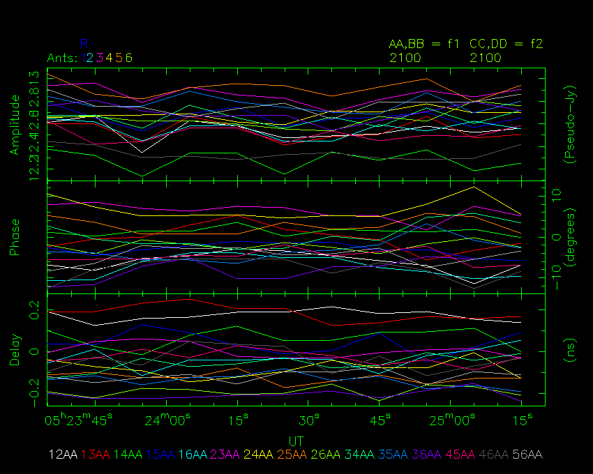
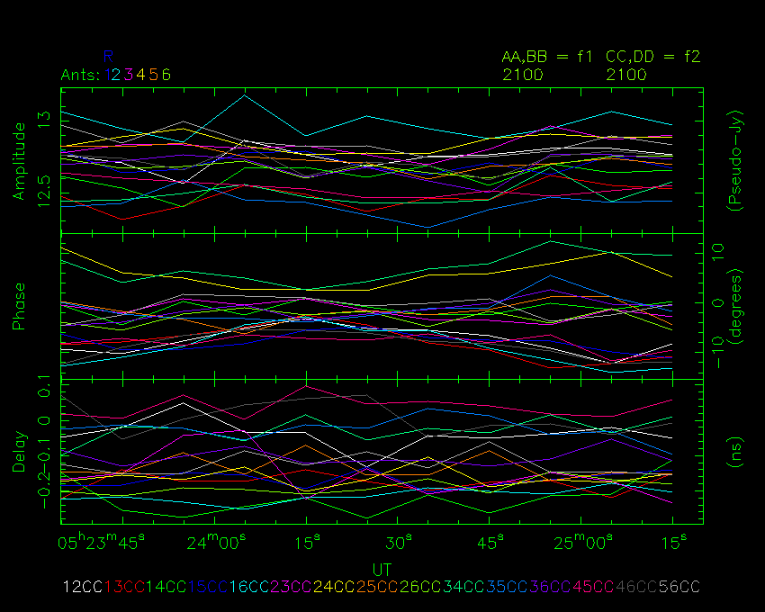
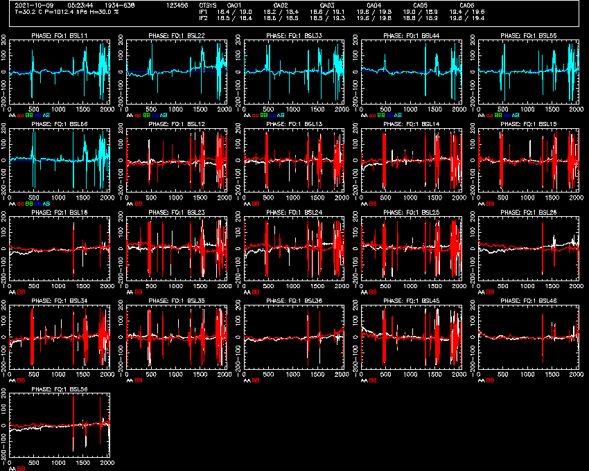
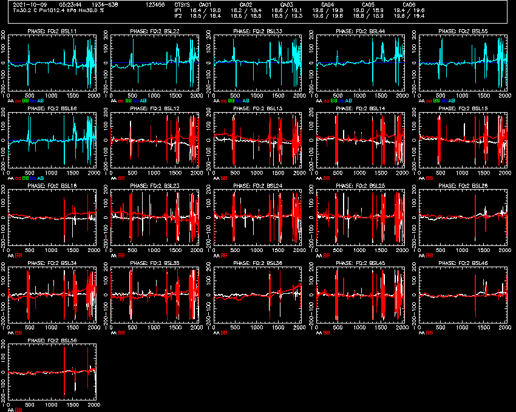

# Tutorial 4
Can you calibrate these challenging data sets? If so, you'll be fine when
you come to do real observing.

# Goals of the tutorial

Put what you have learned in the first three tutorials to use, to tackle some
more challenging initial calibrations.

## Starting the tools for this tutorial

It is assumed that you have already completed both [tutorial 1](../1_introduction/),
[tutorial 2](../2_dcal_and_delavg/), and [tutorial 3](../3_acal_and_tsys),
and so have already obtained and compiled the tools.

Once again, we open up three terminals. In one of these terminals, navigate to
the path `atca-training/tutorials/4_challenging_calibration` and in the other two
go to `atca-training/build`.

You should download the RPFITS file that we will use for this tutorial from
our website:

Put it into the `atca-training/tutorials/4_challenging_calibration` directory.

## The challenges

### Challenge 1

From that same directory, start the `rpfitsfile_server` with the command:
```bash
../../build/rpfitsfile_server -n 2021-10-09_0514.C999 -j 59496.22465278 -J 59496.22581019
```

The `-j` and `-J` arguments tell the server to make only a subset of the data
in the file available, since there is more data before and after the calibration
that was done online. However we don't need to worry about what the observer did,
we want to calibrate the data ourselves.

When you see the `Waiting for connections...` output, you can start using
the other tools.

Start NSPD in one of the other terminals:
```bash
./nspd -d /xs -s 127.0.0.1 -u usr123
```

You should feel free to change `-d /xs` to use a different interactive PGPLOT
device if you'd like, and to change `-u usr123` to use a different username.

Start NVIS in the third terminal:
```bash
./nvis -d /xs -s 127.0.0.1 -u usr123
```

Once again, you can change the PGPLOT device to whatever you want, but you
should make sure if you changed `-u usr123` for NSPD, do the same here for NVIS.

At this point NSPD and NVIS should look something like the following two
images.


#### Goal

In this dataset, we are observing 1934-638 with the 16cm receiver, for just a couple
of minutes. You should be able to use the tools to work out everything else about the
observation and the data.

Doing the initial delay, amplitude and phase calibrations can be tricky at 16cm, since
RFI can get in the way. Using any time range for NVIS calibration, and any reference
antenna, get the data to look very similar to the following images.









